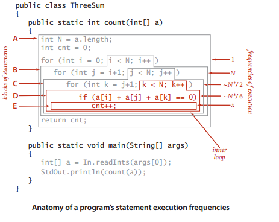
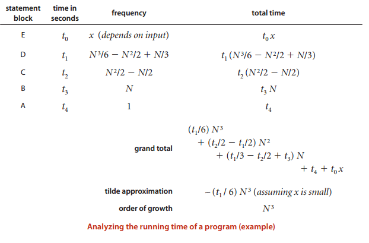
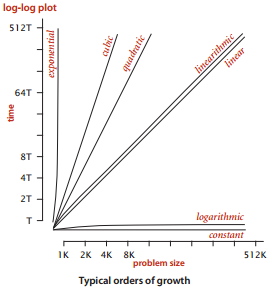
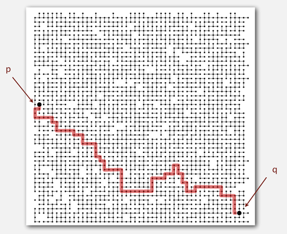

# Анализ алгоритмов

## Почему так важен анализ алгоритмов

Чтобы у пользователей или программистов не возникал вопрос "А почему моя программа так медленно работает?", будучи разработчиком, нужно уметь анализировать следующие важные вещи:

1. *Running time* алгоритма (математические модели) для разного размера наборов данных
2. *Memory usage* для алгоритмов и структур данных (языки программирования, операционная система)

Собственно, анализ времени выполнения алгоритмов и является наиболее главным в этом вопросе.

Причины анализировать алгоритмы:

1. Предсказывать эффективность
2. Сравнивать алгоритмы
3. Предоставлять гарантии
4. Понимать теоретический базис (теория алгоритмов)
Самая важная причина: избежать багов эффективности!!!

Методы анализа алгоритмов и их особенности:

- Научный метод:
  - математическая модель независима от конкретной системы
  - эмпирический анализ является необходимым для валидации математических моделей и чтобы делать предсказания
- Построение математической модели (мат. анализ):
  - анализируем алгоритм чтобы посчитать частоту операций
  - используем тильда нотацию чтобы упростить анализ
  - модель позволяет нам *объяснять поведение*
- Эмпирический анализ: 
  - запустили программу на разных по размеру инпутах и засекли время
  - Предполагаем степенной закон и формулируем гипотезу для running time
  - модель позволяет нам *делать предсказания*

## Научный метод

Научный метод:

1. Наблюдение некоторых признаков естественного мира, как правило с точными измерениями.
2. Формулирование гипотезы - модели, которая согласуется с наблюдениями.
3. Прогнозирование - предсказывать события используя гипотезу.
4. Верификация - проверить предсказания сделав дальнейшие наблюдения.
5. Валидация - повторяем пока гипотеза и наблюдения не согласуются.

На алгоритмах:

1. Эмпирический анализ: наблюдение.
2. Анализ данных (формулируется гипотеза): используется регрессионный анализ и строится прямая вида `T(N) = a N^b` (*power law*), где `b` - *slope*.
Гипотеза будет выглядеть, например, так:
   > The running time is about `1.006 × 10^–10 × N^2.999` seconds.

   Причем порядок роста функции будет `N^3` (смотрим на последний множитель).
3. Прогнозирование и валидация: подставляем в формулу `N` и получаем время.
4. Гипотеза удвоения: проще просто удвоить инпут в размере и получить `b`.

## Математический анализ

*Total running time* программы определяется двумя факторами:

- Стоимостью выполнения каждого оператора (*statement*)
- Частотой выполнения каждого оператора.

Термины, которые нужны для выполнения мат. анализа: тильда аппроксимация (*tilde approximation*), порядок роста (*order of growth*), модель стоимости (*cost model*).

### Тильда аппроксимация

Тильда аппроксимация (*tilde* ~) или аппроксимация по лидирующему терму: откидываются термы низкого порядка, которые усложняют формулу и отображают пренебрежимо малый вклад в значения, представляющие интерес. 
*Definition*. Мы пишем `~ f(N)` чтобы показать любую функцию, которая при делении на `f(N)`, приближается к `1` когда `N` растет, и мы пишем `g(N) ~ f(N)` чтобы указать, что `g(N) / f(N)` приближается к `1` когда `N` растет.

Пример: `N^3/6 - N^2/2 + N/3 ∼ N^3/6`. Здесь `∼ N^3/6` называется тильда аппроксимацией. Забегая вперед, в этом примере можно получить и порядок роста `N^3` (отбрасывается и константа).

Большую часть времени мы работаем с тильда аппроксимацией в форме
`g(N) ∼ a f(N)`, где `f(N) = N^b (log N)^c`  с `a`,`b` и `c` константами, а `f(N)` -  порядок роста `g(N)`.

Другие нотации: Big Theta, Big Oh, Big Omega. См. ниже, Теорию алгоритмов.

> Частая ошибка - интерпретировать Big Oh как апроксимирующую модель
> В курсе *Coursera Algorithms: Part 1-2* используется *Tilde-notation*

### Гипотеза порядка роста

*Property*. Порядок роста времени выполнения ThreeSum (чтобы вычислить число троек, которые суммируют числа от *0* до *N*) есть *N^3*.

> Property - это терм, ссылающийся к гипотезе, которую нужно проверить (валидировать) через эксперимент.

*Evidence*: Пусть *T(N)* будет временем выполнения ThreeSum для *N* чисел. Только что описанная математическая модель предполагает, что *T(N) ~ a N^3* для некоторой машинно-зависимой константы *а*; эксперименты на многих компьютерах валидируют эту аппроксимацию. 

Рассмотрим пример ThreeSum. Найдем частоты выполнения блоков операторов:

То есть if оператор выполняется точно `N (N - 1) (N - 2) / 6` раз (число путей подобрать `3` разных числа из *input array*). `6` потому что `3! = 1 * 2 * 3`. 

Анализ времени выполнения будет следующим:

Порядок роста позволяет нам разделить программную реализацию от алгоритма. Алгоритм определяет порядок роста. Разделение алгоритма от реализации позволяет нам разрабатывать знания о производительности алгоритма и затем применять это знание к любому компьютеру.

#### Класификация порядков роста (order-of-growth classifications)

There is the small set of functions suffices to describe order-of-growth of typical algorithms:

- 1 - constant order of growth
- log N - logarithmic
- N - linear
- N log N - linearithmic
- N^2 - quadratic
- N^3 - cubic
- 2^N - exponential

#### Модель стоимости

Модель стоимости определяет стандартные операции, используемые алгоритмом, который мы изучаем. Для проблемы ThreeSum моделью стоимости будет *количество доступов к массиву*: `a[i] + a[j] + a[k]`. С помощью этой модели стоимости мы можем делать точные математические выражения о свойствах алгоритма, не только о конкретной реализации.

Наша цель: находить модели стоимости, такие что порядок роста времени выполнения для данной реализации такой же как и порядок роста стоимости нижележащего алгоритма (другими словами,  модель стоимости должна включать операции в *inner loop*).

#### Выводы. Нахождение математической модели *running time*

Для многих программ, разрабатывание мат. модели running time разделяется на такие шаги:

1. Разработать *input model*, включая определение проблемы размера
2. Найти *inner loop*
3. Определить *cost model*, которая включает операции в *inner loop*.
4. Определить частоту выполнения операций для данного *inputа*. Используя математический анализ, показать порядок роста.

Пример "Бинарный поиск":

- *input model* - это массив `a[]` размера `N`;
- *inner loop* это операторы в одиночном `while` цикле
- *cost model* - это операция сравнения (сравнение значений двух энтрисов массива)
- анализ показывает, что число сравнений не более чем `lg N + 1`

> При исследовании могут быть полезны различные аппроксимации. Например, 1 + 1 + 1 + … + 1 = lg N. См. папку Images.

## Теория алгоритмов

### Типы анализа

- Best case - lower bound по стоимости (чтобы разработать lower bound нужен `Ω(N)`)
  - определяется по "простому" инпуту
  - предоставляет цель для всех инпутов  
- Worst case - upper bound по стоимости (чтобы разработать upper bound нужен `O(N)`)
  - определяется по "самому тяжелому" инпуту
  - предоставляет гарантию для всех инпутов
- Average case - "ожидаемая" стоимость
  - нужна модель "рандомного" инпута
  - предоставляет способ предсказывать производительность  
  
Ex 1. Доступы к массиву для brute-force ThreeSum:

Type | Tilde approximation
--- | ---
Best | `~ 1/2N^3`
Average | `~ 1/2N^3`
Worst  | `~ 1/2N^3`

Ex 2. Сравнения для бинарного поиска:

Type | Tilde approximation
--- | ---
Best | `~ 1`
Average | `~ lg N`
Worst  | `~ lg N`

### Обозначения в теории алгоримтов

Notation | Provides | Example | Shorthand for | Used to
--- | --- | --- | --- | ---
Tilde | leading term | ~ 10 N^2 | 10 N^2   10N^2 + 22N log N   10N^2 + 2N + 37 | provide approximate model
Big Theta | asymptotic growth rate | Θ(N^2) | ½ N^2   10N^2   5N^2 + 22N log N + 3N | classify algorithms
Big Oh | Θ(N^2) and smaller | O(N^2) | 10 N^2   100 N   22N log N + 3N | develop upper bounds
Big Omega | Θ(N^2) and larger | Ω(N^2) | ½ N^2   N^5   N^3 + 22N log N + 3N | develop lower bounds

### Дополнительные заметки

- Оптимальный алгоритм гарантирует, что lower bound ~ upper bound.
- Подход к проектированию алгоритмов предполагает сначала разрабатывание алгоритма, а потом доказывание lower bound. Если есть gap - опускаем upper bound (находим новый алгоритм) или подымаем lower bound (тяжелее - как у union-find). Собственно, за последние десятилетия люди постепенно опускали upper bound, благодаря чему мы получили много эффективных алгоритмов.
- Для анализа алгоритмов лучше использовать "тильда нотацию" (~) для предоставления приблизительных моделей (*approximate models*). Зачем она? Ну она лучше описывает функцию. Предоставляет как upper bound так и lower bound

> В Инете я нашел ответ на вопрос про разницу ~ и O. Есть 2 разницы между ними:
> i. O предоставляет upper bound, а ~ - и upper bound, и lower bound. Другая нотация с такими же свойствами, что и ~ - это Θ.
> ii. O поддерживает только константу: f=O(g) если f(n)≤Cg(n) для некоторой константы C>0 (и достаточно большой n). С другой стороны для ~ указанная константа всегда 1: если f~g тогда f/g->1. Это контрастирует с Θ, в которой константа произвольная (arbitrary) и в самом деле могут быть разные константы для lower и upper bounds.
> Точные константы в целом непрактичны по многим причинам: они зависят от машины, трудны для вычисления и могут колебаться в зависимости от n. Первая проблема может быть смягчена путем измерения некоторого приближения фактической сложности времени, например, количества сравнений в алгоритме сортировки (модель стоимости?).
Кажется, что в курсе они используют Θ, но называют его порядком роста.

### Пример ThreeSum

Цель: установить "сложность" задачи и разработать "оптимальные" алгоритмы.

Upper bound. Специфический алгоритм:

- Например, *Улучшенный* алгоритм для ThreeSum
- Running time оптимального алгоритма для ThreeSum является `O(N^2 log N)`

Lower Bound. Доказательство того, что ни один алгоритм не может делать это лучше.

- Например, мы должны проверить все `N` энтрис чтобы решить ThreeSum
- Running time оптимального алгоритма для решения ThreeSum будет `Ω(N)`.

Открытые проблемы (TODO: проверить на актуальность):

- есть оптимальный алгоритм для ThreeSum?
- *Subquadratic* алгоритм для ThreeSum?
- Квадратичный lower bound для ThreeSum?

## Steps to developing a usable algorithm (could be a framework)

> According to Coursera: Algorithms.

1. Model the problem.
    > Understand the problem. What are the elements (parts) of the problem that need to be solved? How can we present them in a code? Objects? How do those objects connect to each other? So, we should think about many different things.
2. Find an algorithm to solve it.
    > First attempt.
3. Fast enough? Fits in memory?
    > Run the program on different inputs and see what happen. Is algorithm fast enough? Fits in memory? If not, go to step 4. Steps 3 and 4 could be considered together. If we like our algorithm then we can just be off with it.
4. If not, figure out why.
    > Build a model of running time using math analysis (and a model of memory usage using our knowledge of computer and programming language). First we choose cost model for our algorithm. For example, number of array accesses. Then we should check running time of each method/fuction according to this cost model. We need to find the most expensive operation. This operation could take >= `N^2` array accesses in the worst case which is really bad. Maybe we can assume that the operation which take N array accesses actually take `N^2` because it executes on N objects (`N * N`). Notice, that we use order of growth which discards leading term in tilde notation. And we use tilde notation because it provides approximate models, accurately describes function and provides both upper bound and lower bound.
5. Find a way to address the problem.
    > Develop other algorithm.
6. Iterate until satisfied.
    > Do experiments to validate those models and help us to improve things. Then go to step 3.

This is the *scientific approach* (method) to designing and analyzing algorithms where we build *mathematical models* to try and understand what's going on, and then we do *experiments* (empirical analysis) to validate those models and help us improve things.

### Example

Problem: "Dynamic connectivity problem".
Given a set of N objects. We need to connect two objects (union).
Is there a path connecting two objects (find)?

Answer is yes but how can we compute this?

Let's develop an algorithm:

1. Model the problem
   - Modelling the objects (elements):
     - We will identify objects by indices from 0 to N - 1.
     - We will use array of objects which will consist of integers (one object is an array element.). Those integers will indicate to which component current object belongs to. Example: [3, 3, 2, 3] means that objects "0", "1" and "3" belong to component "3".
   - Modelling the connections (through equivalnce relation):
     We assume "is connected to" is an equivalence relation:
     - Reflexive: p is connected to p.
     - Symmetric: if p is connected to q, then q is connected to p.
     - Transitive: if p is connected to q and q is connected to r, then p is connected to r.
2. Find an algorithm to solve it.
    This will be our first attempt. Let's say we developed QuickFind algorithm.
3. Fast enough? Fits in memory? (we won't consider memory in this example because for best algorithm we need to use a lot of memory)
    - QuickFind algorithm. Well, find() operation is really fast but it feels like union() operation is pretty slow. Also trees are flat, but too expensive to keep them flat.
    - QuickUnion algorithm. Apparently union() is fast but find() is really slow.  Trees can get tall.
    - WeightedQuickUnion with Weighting. find() takes time proportional to depth of p and q. union() takes constant time, given roots. Fast algorithm but we can make it faster.
    - WeightedQuickUnion + Path Compression. Weighted quick union (with path compression) makes it possible to solve problems that could not otherwise be addressed.
4. If not, figure out why.

    algorithm | initialize | find | union
    --- | --- | --- | ---
    QuickFind | N | 1 | N
    QuickUnion | N | N | N
    WeightedQuickUnion (Weighting) | N | lg N| lg N
    WeightedQuickUnion + Path Compression | N | lg* N | lg* N

    > lg* N is an iterated logarithm which grows very slowly, much slower than just log N. You basically just keep iteratively 'logging' the answer until it gets below one (E.g: log(log(log(...log(N)))), and the *number of times* you had to log() is the answer.

5. Find a way to address the problem.
    We developed QuickFind -> QuickUnion -> WeightedQuickUnion (Weighting) -> WeightedQuickUnion + Path Compression.
6. Iterate until satisfied.
    We developed different algorithms, their models and then find out that WeightedQuickUnion + Path Compression is the best algorithm on dynamic connectivity problem.
