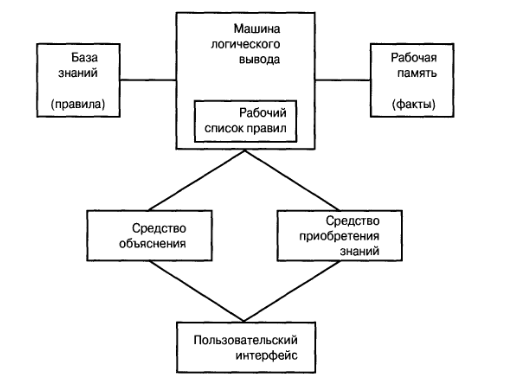

# Экспертные системы

## Структура экспертной системы

Экспертную систему можно представить в виде:

База знаний - набор задокументированных правил. Правила могут быть представлены таким образом (например продукциями):
`IF условие/паттерн/шаблон/антецедент/LHS`
`THEN заключение/вывод/действие/консеквент/RHS` (это всё прямой вывод)

Машина логического вывода - программный компонент, формирует логический вывод. Она принимает решение о том, каким правилам удовлетворяют факты (или объекты): берёт из рабочей памяти факт и сравнивает его с правилами в базе знаний; если совпадение, то добавляет в рабочий список правил. Машина также сортирует правила по приоритетам (!) и выполняет правило с наивысшим приоритетом!

Рабочий список правил - созданный машиной список правил рассортированных по приоритетам, шаблоны которых удовлетворяют фактам или объектам в рабочей памяти. 

Рабочая память - глобальная база фактов, используемых в правилах. 

Запуск правила - выполнить его действие (правая часть правила). Активизированное правило - это правило, все шаблоны которого удовлетворены.

##### Работа машины логического вывода
`WHILE` работа не окончена
- `Разрешение конфликтов`. Если имеются активизированные правила, то выбираем с наивысшим приоритетом, иначе - конец работы.
- `Действие`. Последовательно осуществляем действия в правой части выбранного активизированного правила. Только что запущенное правило удаляется из рабочего списка правил.
- `Согласование`. Обновить рабочий список путём сопоставления с шаблоном (pattern matching): сопоставляем левую часть правила с фактами. Если ОК, тогда активизировать соответствующее правило. Удалить активизированные правила, если левая часть соотв. не выполняется.
- `Проверка условия остановки`. Конец если был `break`.

`END-WHILE`

## Технологии лежащие в основе экспертных систем основанных на правилах

Продукционные системы:
1. Система Поста. Продукционная система Поста основана на постановке правил: `IF антецедент THEN консеквент`
Преимущества: простота
Недостатки: отстутствие стратегии управления, которая позволяла бы регламентировать применение правил.
2. Алгоритмы Маркова - продукционная система основанная на применении правил с высшими приоритетами и подстановках.
3. *Rete*-алгоритм - функционирует как сеть (предназнач. для хранения большого объёма информации), обеспечивает быстродействие при запуске правил, алгоритм основан на динамической структуре данных.

## Модели представления знаний 

> Алгоритмы + Структуры данных = Программы

А вот

>Знания + Логический вывод = Экспертные системы

Можно сказать, что экспертные системы формируют логические выводы, основываясь на знаниях. Знания - это некие правила. Это могут быть знания эксперта, то есть это неявные знания и его навыки.

Знания в экспертных системах могут быть представлены разными способами. Методы представления знаний (модели):
1. Правила и продукционные правила
2. Семантические сети
3. Фреймы
4. Сценарии
5. Логика
6. Концептуальные схемы