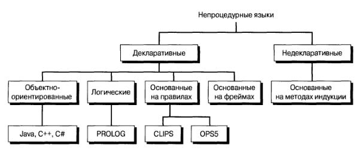

# Принципы программирования

## Процедурные подходы

Процедурные (последовательные) языки:
1. Императивные - последовательные, нисходящее проектирование (последовательное уточнение управляющей системы), сложные структуры.
2. Функциональные - последовательные, восходящее проектирование, обеспечение ссылочной прозрачности, в основе обычно лежат *лямбда-исчисления*.

> Ведение разработки объекта последовательно от общих черт к детальным называется *нисходящим проектированием*. Его результатом будут требования к отдельным частям и узлам. 
Возможен ход разработки от частного к общему, что образует процесс *восходящего проектирования*. Такое проектирование встречается, если одна или несколько частей уже являются готовыми (покупными или уже разработанными) изделиями.

Императивное программирование - это парадигма, которая описывает процесс вычисления в виде инструкций, изменяющих состояния данных.

Функциональное программирование - это парадигма программирования, которая описывает вычисление значений функций, в математическом смысле последних.

## Непроцедурные подходы

Декларативное программирование - это парадигма программирования, которая предусматривает описание того, *что* из себя представляет проблема и результат (в общем, всё означает спецификацию). В противоположность декларативному программированию ставиться императивное - то *как* должна решаться задача и *как* должен представляться результат.

Непроцедурные языки:
1. Декларативные (путь достижения цели от методов):
    - объектно-ориентированные - и императивный, и декларативный. 
       - декларативный в ООП: мы пытаемся представить данные в виде объектов.
       - императивный в ООП: мы пытаемся решить эту проблему определяя операции для этих самых объектов.
    - логические
    - основанные на правилах
    - основанные на фреймах
2. Недекларативные (основанные на индукции)

Примечание:
> функциональное программирование можно считать декларативным, а структурное и ООП - всё-таки императивным.