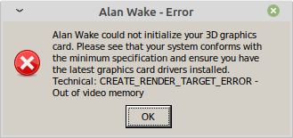
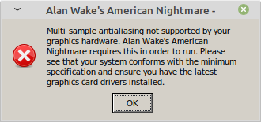

# Solving problems with games on Linux

> In this document I describe my experience with Lutris, Proton, and Wine utilities.

## Table of Contents

1. [Issues with hardware](#Issues-with-hardware)
2. [Where to install games](#Where-to-install-games)
3. [Wine, its variations and problem with them](#Wine-its-variations-and-problem-with-them)
   1. [Lutris](#Lutris)
   2. [Proton](#Proton)
   3. [Pure Wine](#Pure-Wine)
   4. [Steamtricks](#Steamtricks)
   5. [Linux steam integration](#Linux steam integration)
4. [Alan Wake and Alan Wake American Nightmare](#Alan-Wake-and-Alan-Wake-American-Nightmare)
5. [Deus Ex with GMDX mod](#Deus-Ex-with-GMDX-mod)
6. [GTA III](#GTA-III)
7. [Max Payne](#Max-Payne)
8. [Super Meat Boy](#Super-Meat-Boy)
9. [The Talos Principle](#The-Talos-Principle)
10. [Just in case](#Just-in-case)
11. [References](#References)

## Issues with hardware

### Configuring AMD graphics

> ToDo: this information may be outdated and false. Reason is that there was an issue with kernel. It recognized my video card as `radeon` when it needs to be `amdgpu`.

I finally figured out how to configure my AMD card (Radeon HD 8750M, Solar System series) on the Linux. The problem is that Ubuntu stopped the support for the AMD Catalyst (fglrx) driver.  There are a few possible ways to solve this problem:

1. Install the drivers from the open-source PPA repository. I chose the open source way because proprietary isn't working anymore (at least for the updated version of operating system). It might be strange, but this didn't work on my laptop (HP ProBook 450 GO).

2. We can tell Steam to use the second video card by launching it with the next command:

   ```bash
   $ DRI_PRIME=1 steam
   ```

3. If we use the old system such as Ubuntu 14.04 LTS, we can follow the proprietary way from or the next guide from. Some of the packages don't exist under these links, but they can be found on the Internet which, you know, might be difficult :( Also, we might encounter a few bugs such as this one.

> Also, we can check  if the second video card works by launching the **radeontop** application.

**Is DRI_PRIME=1 still needed to use discrete graphics card?**

If you're on AMD, yes.

**How can I check that my OS recognizes discrete video card?**

Use `xrandr` command in order to get the list of video cards. This what I got (new version):

```bash
Providers: number : 2
Provider 0: id: 0x46 cap: 0x9, Source Output, Sink Offload crtcs: 3 outputs: 4 associated providers: 1 name:modesetting
Provider 1: id: 0xbb cap: 0x4, Source Offload crtcs: 2 outputs: 0 associated providers: 1 name:modesetting
```

> Old version:
>
> ```bash
> xrandr --listproviders
> Providers: number : 2
> Provider 0: id: 0x46 cap: 0x9, Source Output, Sink Offload crtcs: 3 outputs: 4 associated providers: 1 name:modesetting
> Provider 1: id: 0xbb cap: 0x6, Sink Output, Source Offload crtcs: 2 outputs: 0 associated providers: 1 name:OLAND @ pci:0000:01:00.0
> ```

So, my OS (Linux Mint 20) recognizes all the video cards, which is nice. If you don't get one of the video cards then check [this](https://www.reddit.com/r/linux_gaming/comments/77zmsy/is_dri_prime1_still_needed_to_use_discrete/) discussion.

**How do you switch between hybrid graphic cards?**

There is a [discussion](https://forums.linuxmint.com/viewtopic.php?t=279363) on Linux Mint forum. 

## Where to install games

It is very important that the games are installed on the ext4 file system, otherwise they won't work. However, there are some [tweaks](https://www.reddit.com/r/SteamPlay/comments/aafhcn/steam_proton_doesnt_launch_any_games/) that might help to run them on the NTFS file system:

> For NTFS you'll need something like this: `ntfs-3g defaults,exec,uid=1000,gid=1000 0 2`
>
> > Try changing gid=1000 to gid=100 (users) and see if that helps.
>
> Make sure that you are *not* using the `windows_names` flag.
>
> For ext4, something like `ext4 defaults 0 2` and make sure you give your user permissions for the drive: `sudo chown -R USERNAME:USERNAME /media/mynewdrive`.

## Wine, its variations and problem with them

In [this discussion](https://steamcommunity.com/app/221410/discussions/0/2798319091580289893/) people think that Wine is better for gaming than Proton. Proton is the tool that tries to give the full compatibility to all the Windows games without Linux native compatibility, but in most cases it fails (AAA games). So, Wine is better but it is hard to tweak it, because you need to adjust each game individually.

### Lutris

**Issue. Flickering when using Origin and all its games**

**Solution.**

Disable DXVK/VKD3D (this enables Direct3D 12 support and increases) compatibility and performance in Direct3D 11, 10 and 9 applications by translating their calls to Vulkan.

**Issue. Getting Lutris to recognize Steam games that are already installed**

**Solution.**

> [Source](https://www.reddit.com/r/linux_gaming/comments/7havmh/getting_lutris_to_recognize_steam_games_that_are/).

this is a bit tricky

run the installer, log into steam, when it asks you to install the game keep the install window up, but dont run it, and dont close it.

(The reason I say don't close it is because lutris has a process monitor that keeps tabs on when steam closes so that it can continue the installer. )

Anyway, with steam still running, go to the settings, add your steam library folder. THEN cancel the steam game installer, then cancel the lutris installer. Then run it again. It should instantly complete.

**Just in case.**

https://forums.lutris.net/t/please-read-before-asking-for-help/3727

https://forums.lutris.net/t/dxvk-support/6712

https://forums.lutris.net/t/dark-souls-ii-screen-flicker/689/2

https://forums.lutris.net/t/major-screen-tearing-after-lol/8318/2

https://forums.lutris.net/t/epic-games-launcher-flickering/4455/7

https://forums.lutris.net/t/lutris-origin-dragon-age/6304

https://forum.winehq.org/viewtopic.php?t=12285

https://forum.winehq.org/viewtopic.php?t=33141

https://www.reddit.com/r/Lutris/comments/jlmxkv/black_or_flickering_steam_screen_on_wine_steam/ - not yet answered

https://www.reddit.com/r/linux_gaming/comments/hqhxb5/lutrisorigin_flickering_manjaro_kde_help/

https://www.reddit.com/r/wine_gaming/comments/au0xpy/how_to_get_rid_of_blinking_epic_games_launcher_on/

https://www.reddit.com/r/linux_gaming/comments/99qyvh/lutris_and_steamplay_monster_hunter_world/

https://forums.lutris.net/t/how-can-i-run-a-windows-application-in-a-steam-games-folder/5736/4

> …Just tried running Winesteam, installing a game and importing from it. The imported icon *does* in fact have the “Run EXE inside wine prefix” option, same as regular Wine games.
>
> Did you perhaps install the game in native Steam (via Proton)? If you did you should’ve mentioned that, since as far as Lutris can tell it’s a native Linux game install.
> For Proton, you’ll have to [install `protontricks` utility 36](https://github.com/Matoking/protontricks#pipx-recommended) (Proton wrapper for `winetricks`), and then use it to run the program from shell. The following is usage example for running Duke Nukem Manhattan Project configurator:
>
> ```bash
> $ protontricks -s duke   # querying prefix id
> Found the following games:
> Duke Nukem: Manhattan Project (240200)
> $ protontricks 240200 shell
> <steam-game-dir>/steamapps/compatdata/240200/pfx/dosdevices/c: $
> # shell session opens in C: of wineprefix, <steam-game-dir> is configured Steam game folder
> $ which wine    # checking if using correct wine binary
> <steam-game-dir>/steamapps/common/Proton 4.2/dist/bin/wine
> $ cd <steam-game-dir>/steamapps/common/"Duke Nukem Manhatten Project"
> $ wine MPconf-old   # running MPconf-old.exe
> $ exit   # closing Proton shell session
> ```

https://forums.lutris.net/t/questions-about-how-to-use-and-configure-lutris-to-use-steam/76/3

https://forums.lutris.net/t/wine-steam-games-get-black-screen-on-start-up-work-fine-without-steam/4175

https://forums.lutris.net/t/how-i-got-the-winesteam-runner-to-work-properly-under-lutris/6791

https://forums.lutris.net/t/wine-steam-runner/447/3

https://forums.lutris.net/t/how-to-import-games-installed-on-another-linux-distribution/6710

### Proton

#### Customizing Wine prefix in Proton

According to @meheezen:

> Well, you can tweak some things just like you do in WINE, since Proton is pretty much WINE with a few Valve tweaks and content.
>
> I haven't had much issues with it tho, but i don't play that many games (i did have to make some changes to WINE within Proton to get some of them to work tho).

> You can aways create an empty WINE prefix and customize it the way you want instead of using the one Steam creates for you.

> i remember having to do some tweaks to get The Sims 3 to run properly, tho i cannot seem to find the link (will update when i find it), it went something like this:
> 1- copy proton specific files from the wine prefix Steam made for you (there is some files in the pfx directory and a proton directory inside of program files)
> 2- delete the prefix
> 3- create a new one at the same place using wine
> 4- install .Net and other dependencies
> 5- copy/move back the proton specific files
> 6- play
>
> Edit: found it
> https://www.reddit.com/r/linux_gaming/comments/99e0kc/steam_playguide_create_custom_32bit_prefix_to/
>
> you just need to create the syswow64 directory to stop proton from complaining
>
> so delete prefix, create new one with wine, create that syswow64 directory within c:\windows and tweak as you want

### Pure Wine

### Steamtricks

Steamtricks app available [here](https://github.com/steamtricks/steamtricks) for Ubuntu and similar operating systems.

Also, it is available for OpenSuse [here](https://software.opensuse.org/package/steamtricks).

### Linux steam integration

Linux steam integration app for Solus project can be found [here](https://github.com/solus-project/linux-steam-integration).

## Alan Wake and Alan Wake American Nightmare

## Alan Wake

**Issue**

I got the next error in the game:



**Solution**

I don't really know the exact solution because I tried a few things and somehow the issue was fixed. After that, I cleaned the wineprefix and, and, funny thing is, it all worked out :man_shrugging:  I have only suggestions as to why it worked. The first one is probably the most reliable.

- You can use Lutris winetricks in order to download the next packages easily:
  - d3dcompiler_43 and d3dcompiler_47
  - d3dx10, d3dx9, d3dx11_43 (probably), d3dxof (probably)
  - dotnet48, dotnet_verifier (probably), dotnetcore 2 (probably)
  - vcrun2008, vcrun2010, vcrun2012, vcrun2013, vcrun2015, vcrun2017, vcrun2019 (this one combines 2015-2019)
  - vcrun6 (probably), vcrun6sp6 (probably)
  - setupapi (probably)
- DLL overides. Found these ones in the Wine configuration (similar names are also included): api ms win crt, atl, concrvt, msvcp, msvcr, ucrtbase, vcomp, vcruntime.
- Update Lutris? I mean this is what helped me when I removed Wine prefix :man_shrugging: Or there were some inconsistencies with the game that was installed on NTFS partition.
- Reinstall the game.

## Alan Wake American Nightmare

**Issue**

I got the next error in the game:



**Solution**

The same as in Alan Wake :man_shrugging:

## Deus Ex with GMDX mod

> Launched via Proton 5.0 (not 5.13 where I have flickering).

**Issue. Install GMDX mod.**

**Solution.**

- Install Deus Ex with Steam Play. You need to have the option to install any game with Steam Play in the Steam settings.
- Download [GMDX](https://www.moddb.com/mods/gmdx) and install it with [Wine](https://www.winehq.org/). You will have to have Wine installed. Also Wine wouldn't show all my Steam directories to to get around this I copied my Deus Ex folder to my home folder for the install. It is located in /home/yourusername/.steam/steam/steamapps/common. After GMDX installs copy the folder back to it's original location.
- Right click on Deus Ex in your steam library, go to properties and copy this into your launch options:
  INI="..\GMDXv9\System\gmdx.ini" USERINI="..\GMDXv9\System\GMDXUser.ini"

**Just in case.**

- If you have problem with launching the game, then maybe there is a problem with the launcher itself. You can replace it with [this](http://kentie.net/article/dxguide/index.htm) mod.

- If you get this error 

  ```
  Can't find 'ini:Engine.Engine.GameEngine' in configuration file
  ```

  then there is a problem with .ini files. It would be great to reinstall Deus Ex, and Proton version if the first step didn't help.

  > Sure, you can delete and pull .ini files, but it didn't help me.

## GTA III

>  Launched via Proton 5.0 (the game doesn't launch with 5.13).

It works fine with Proton 5.0. You need to press enter a few times after the launch in order to remove black screen.

> I got flickering in Proton 5.13 and unhandled exception in Proton below

Also, I turned Trails off in order to remove the motion blur.

Installed Widescreen and Silent patches. After exiting the game, I get the next error:

```
Gta 3 Unhandled exception c0000005
```

This is similar to [this](https://steamcommunity.com/app/12100/discussions/0/483367798514700344/) one. It's not critical but it's really interesting how to fix this :thinking:

Other tips from [ProtonDB](https://www.protondb.com/app/12100):

> Works fine with Proton. I copied dgvoodoo2 files, enabled d3d8 as native in winecfg and then this game worked as well with DXVK (only some graphical glitches with cars).

> You have to press a button after it launches to get your screen to change to the full screen game (I press space or enter). Sometimes it makes system unresponsive when you choose to quit the game. Tab out and close from your taskbar instead. Otherwise it plays perfectly for me. Mods works as well (Silent Patch, controller support, widescreen fix). https://steamcommunity.com/sharedfiles/filedetails/?id=641839127

> Works very well. Saving the game doesn't work out of the box. You must create a folder called My Documents In (/home/username/.steam/steam/steamapps/compatdata/gameID/pfx/drive_c/users/steamuser

> Game runs flawlessly in 1920x1080. When game launches, wait for screen to blink, then click mouse button twice to start the game. Go to the video settings and change resolution, maximize draw distance and turn frame limiter off. If you are annoyed with the blur effect (it was present in win version), turn trails off. Only issue I found is that you can't save game as the GTA3 want to save it in My Documents which really sucks.

> Runs out of the box. But you should not disable vsync or disable frame limiter, because this may lead to strange effects (e.g. can't drive back when setting in car).

> Works perfectly, just install and play. (use the frame limiter (Optionally with the 60fps frame limiter mod) otherwise all the physics and menu will be broken , but that's a problem that happens on Windows too.

> **You won't have much of a problem unless you're using Wayland**
>
> Launcher:Steam
>
> Customizations:Protontricks
>
> Enabled virtual desktop.
>
> Windowing:Switching
>
> With Wayland/sway, the game freezes as soon as I switched to another workspace. Enabling the virtual desktop fixes this. This is was not an issue with XFCE.
>
> Input:Bounding
>
> With Wayland/sway, the mouse input will sometimes get "bounded", so I can't rotate the camera too much. A single mouse click fixes this.
>
> Make sure to keep the frame limiter on, otherwise you get physics glitches (known bug that affects Windows as well).

> Had to use Protontricks to set up a virtual desktop for the game to start

> Launcher:Steam
>
> Customizations:Custom Proton
>
> Proton-5.9-GE-1-NR from GloriousEggroll [GloriousEggroll](https://github.com/GloriousEggroll/proton-ge-custom/releases)
>
> This custom Proton version enables intro video (no need to skip it)

> Launcher:Steam
>
> Customizations:Custom Proton
>
> 5.11-GE-3-MF [GloriousEggroll](https://github.com/GloriousEggroll/proton-ge-custom/releases)
>
> Audio:Other
>
> Sometimes the voices sound like they come from a tin can
>
> Black screen at start (the intro cutscenes with rockstar logos) can be skipped pressing enter. Using this proton version allowed me to change resolution with no problems.

> **Game runs without issues out of the box.**
> I was also able to install mods like widescreen patch and proper xinput mod. (Used winedlloverrides commands)

## Max Payne

>  Launched via Steam Proton 5.13-2.

**Issue. A network of points appears while shooting.**

A network of points appears while shooting in Max Payne 1. It is connected to the display resolution. My monitor is 1366x768. There is a mode 1366x768x16 in the game, but you need the 32 bit version.

**Solution.**

The easiest solution is to install ["Max Payne - FixItAll"](https://steamcommunity.com/sharedfiles/filedetails/?id=1184013727) patch by community. It includes ThirteenAG's widescreen fix which makes the game 16:9 compatible. Install it with Wine.

## Super Meat Boy

> Launched via Lutris 5.21-2-x86-64.

**Issue 1. Can't launch the game.**

**Solution.**

In my case, I had to disable DXVK/VKD3D in Lutris settings.

> DXVK/VKD3D enables support for Direct3D 12 and increase compatibility and performance in Direct3D 11, 10 and 9 applications by translating their calls to Vulkan.

**Issue 2. The audio plays but sometimes sounds distorted/corrupted (in my case, it is music).**

**Solution.**

Install [Faudio](https://github.com/FNA-XNA/FAudio) as an application in the winetricks. After reading [this](https://github.com/flibitijibibo/flibitBounties/issues/4) issue, I thought that it might help me. And it helped! However, I get the next issue.

**Issue 3. After launching the game again, I get this: "Could not create XAudio2 Device".**

**Solution.**

How to fix this? You need to install [Microsoft DirectX End-User Runtimes (June 2010)](https://www.microsoft.com/download/en/details.aspx?id=8109). It seems that if you are running DirectX 9 you will not get this error, but if you are running Windows 7 with the newest DirectX 11 you might get this error when installing games that use the XAudio2 engine.

Or you can just download Directx 2010 framework from Lutris.

To fix the problem, you need to download an installation file from Microsoft from June 2010, it contains a lot of updates to the DirectX 11 package, among them the XAudio2 engine.

For other recommendations see these links: [a nice guide on Reddit](https://www.reddit.com/r/Supermeatboy/comments/6pi80k/tutorial_getting_super_meat_boy_beta_to_work_on/), [a link about Emulation mode](https://appdb.winehq.org/objectManager.php?sClass=version&iId=22177), [a notes about virtual desktop](https://appdb.winehq.org/objectManager.php?sClass=version&iId=22216).

## The Talos Principle

> Launched via Steam (without Proton).
>
> This issues can be relevant for other Croteam games.

**Issue 1. Fatal error: Cannot set display mode.**

I tried to run my AMD Radeon card for the game called Talos Principle which was tough even for Windows 8.1. The problem I get was the next message:

> Fatal error: Cannot set display mode.

**Solution**

In order to solve this problem, besides the methods I described above, I found the next from steam community [6]:

1. If the video card doesn't support Vulcan feature, then we should switch to "legacy" version which in our case is Ubuntu 13.04 Legacy.

2. If the video card supports Vulcan feature, which is true in my case, then we should install the next additional libraries (if we need them):

   ```bash
   sudo apt install libvulkan1 mesa-vulkan-drivers vulkan-utils  
   ```

**Issue 2. CPU power saving in Croteam game.**

After a launch the game in terminal I've noticed a warning:

```bash
"WRN: CPU Power saving is enabled and performance governor is not used."
```

So, their games are launched in power saving mode.

**Solution**

In order to fix this you can install cpufreq utilities:

```bash
$ sudo apt-get install cpufrequtils
```


and switched CPUs to performance mode:

```bash
$ sudo cpufreq-set -g performance
```

And you can play!

> Thats why devs recommend to disable all cpu power saving modes in bios.

The other options could be:

**thermald**

[thermald](https://www.archlinux.org/packages/?name=thermald) is a Linux daemon used to prevent the overheating of platforms. This daemon monitors temperature and applies compensation using available cooling methods.

By default, it monitors CPU temperature using available CPU digital temperature sensors and maintains CPU temperature under control, before HW takes aggressive correction action. If there is a skin temperature sensor in thermal sysfs, then it tries to keep skin temperature under 45C.

The associated systemd unit is `thermald.service`, which should be [started](https://wiki.archlinux.org/index.php/Start) and [enabled](https://wiki.archlinux.org/index.php/Enable).

**i7z**

[i7z](https://www.archlinux.org/packages/?name=i7z) is an i7 (and now i3, i5) CPU reporting tool for Linux. It can be launched from a Terminal with the command `i7z` or as GUI with `i7z-gui`.

**cpupower**

[cpupower](https://www.archlinux.org/packages/?name=cpupower) is a set of userspace utilities designed to assist with CPU frequency scaling. The package is not required to use scaling, but is highly recommended because it provides useful command-line utilities and a [systemd](https://wiki.archlinux.org/index.php/Systemd) service to change the governor at boot.

The configuration file for *cpupower* is located in `/etc/default/cpupower`. This configuration file is read by a bash script in `/usr/lib/systemd/scripts/cpupower` which is activated by *systemd* with `cpupower.service`. You may want to [enable](https://wiki.archlinux.org/index.php/Enable) `cpupower.service` to start at boot.

**cpupower-gui**

It's described in detail here: [link](https://wiki.archlinux.org/index.php/CPU_frequency_scaling#cpupower).

**Issue 2. Launching on a discrete GPU.** 

The games don't launches on a discrete video card. I have a laptop with hybrid graphics. Intel 4000 and AMD Radeon 8750M are cards I have.

**Solution.**

The problem is not only that the games work on an integrated video card, but that the latest version of The Talos Principle only supports Vulkan, not OpenGL. So, there are two solutions:

- In Steam properties switch the game to the "legacy - pre se2017" 'beta'. 

  > Current patch removed dx9 and open gl support (and 32 bit) which I assume is going to be pretty important when you don't have a proper gpu.

  Actually, there are many different versions. I think the legacy Linux version is the best. He here is my tests:

  ```reStructuredText
  ================================
  Testing the legacy Linux version
  --------------------------------
  The android goes somewhere when the gamepad is on. (?)
  
  With DRI_PRIME=1
      FPS ~ 60
            56 while moving
  
  Without DRI_PRIME=1
      FPS ~ 45
            35 while moving
  ==================================
  Testing the original Linux version
  ----------------------------------
  The android goes somewhere when the gamepad is on. (?)
  
  With DRI_PRIME=1
      FPS ~ 20
            15 while moving
  
  Without DRI_PRIME=1
      FPS ~ 10
            5 while moving
  ==================================
  Testing the pre-SE2017 Linux version
  ----------------------------------
  
  With DRI_PRIME=1
      FPS ~ 60
            50 while moving
  
  Without DRI_PRIME=1
      FPS ~ 28
            10
  ```

- Use Prime. GPU-intensive applications should be rendered on the more powerful discrete card. The command xrandr --setprovideroffloadsink provider sink can be used to make a render offload provider send its output to the sink provider (the provider which has a display connected). The provider and sink identifiers can be numeric (0x7d, 0x56) or a case-sensitive name (Intel, radeon).Example:

  ```bash
  $ xrandr --setprovideroffloadsink radeon Intel
  ```

  You may also use provider index instead of provider name:

  ```bash
  $ xrandr --setprovideroffloadsink 1 0
  ```

  Now, you can use your discrete card for the applications who need it the most (for example games, 3D modellers...) by prepending the `DRI_PRIME=1` environment variable:

  ```bash
  $ DRI_PRIME=1 glxinfo | grep "OpenGL renderer"
  OpenGL renderer string: Gallium 0.4 on AMD TURKS
  ```

  Then we need to launch steam with the `DRI_PRIME=1` parameter:

  ```bash
  $ DRI_PRIME=1 steam
  ```

**Issue. Vulkan doesn't detect the discrete video (AMD Radeon HD 8750M,  Solar System series)**

When you launch the game using steam command in terminal, you we'll something like this:

```bash
INF:  Desktop resolution: 1366 x 768
MESA-INTEL: warning: Ivy Bridge Vulkan support is incomplete
WARNING: radv is not a conformant vulkan implementation, testing use only.
INF:  [Vulkan] Detected devices:
INF:    #1 (0x05F70E90): Intel(R) HD Graphics 4000 (IVB GT2) (integrated)
```

So, Vulkan detects an integrated video card, but it doesn't see a discrete one.

**Solution**

The solution is pretty neat. I found it [here](https://github.com/ValveSoftware/Proton/wiki/For-AMD-users-having-issues-with-non-OpenGL-games) which I get from [this](https://www.reddit.com/r/vulkan/comments/fc7to7/vulkaninfo_does_not_recognize_my_main_amd_radeon/) discussion.

So, Vulkan requires the `amdgpu` driver, it doesn't detect the graphics adapter when using `radeon`. `amdgpu` has to be enabled explicitly in the kernel commandline.

Open your terminal and run `sudo nano /etc/default/grub`.

If you have a Southern Islands card append to `GRUB_CMDLINE_LINUX_DEFAULT` the following command: `radeon.si_support=0 amdgpu.si_support=1` .

How did I identify series of my video card? Well, I checked [this](https://www.wikiwand.com/en/Radeon_HD_8000_series) wiki page and found out the following information:

> The GCN-based chips for desktop cards were codenamed as **Southern Islands**, while the mobile ones (again, only the GCN-based and not the rebranded ones) were codenamed as Solar System.
>

So, I used `radeon.si_support=0 amdgpu.si_support=1` in Grub.

My video card on [techpowerup](https://www.techpowerup.com/gpu-specs/radeon-hd-8750m.c1968) shows Sea Islands architecture codename. It isn't Sea Islands. Also, there is a [comparison](https://www.techpowerup.com/178312/amd-sea-islands-and-solar-system-gpu-families-codenames-detailed) of AMD "Sea Islands" and "Solar System" GPU Families Codenames. 

Run `sudo update-grub` and then reboot your system.

You can check which driver is loaded by running `lspci -k`:

```
01:00.0 VGA compatible controller: Advanced Micro Devices, Inc. [AMD/ATI] Mars [Radeon HD 8670A/8670M/8750M]
	Subsystem: Hewlett-Packard Company Mars [Radeon HD 8670A/8670M/8750M]
	Kernel driver in use: amdgpu
	Kernel modules: radeon, amdgpu
```

If your desktop environment doesn't load, check the kernel log by running `sudo dmesg`. If you see that `amdgpu` is crashing, append `amdgpu.dc=0` to the kernel commandline.

However, even after that I couldn't launch DE. My cursor was blinking. I have to use `ctrl+alt+f1` combination in order to launch the terminal at least. After that I executed the following commands:

```bash
apt-get update
dpkg --get-selections | grep xserver-xorg-video
apt-get purge xserver-xorg-video-*
rm /etc/X11/xorg.conf
apt-get install xserver-xorg-video-vesa
sync
reboot
```

Found this advice in this [discussion](https://forums.linuxmint.com/viewtopic.php?t=267058). Additional info can be found in [this](https://forums.linuxmint.com/viewtopic.php?f=42&t=267072&p=1453215#p1453215) post on Linux Mint forum.

Yeah, I removed xorg.conf. Do I need it? No. It doesn't exist by default according to [this](https://askubuntu.com/questions/4662/where-is-the-x-org-config-file-how-do-i-configure-x-there) discussion. Detailed info on xorg can be found on [ArchLinux wiki](https://wiki.archlinux.org/index.php/xorg). 

What is Vesa? Vesa is a generic driver according to [this](https://askubuntu.com/questions/1119425/are-all-xserver-xorg-video-packages-required). They recommend to install other drivers, which I removed. Additional info on vesa can be found [here](https://forums.linuxmint.com/viewtopic.php?t=266554) on Linux Mint forum.

That's how I solved this problem. I got the following info after running inxi:

```bash
Graphics:
  Device-1: Intel 3rd Gen Core processor Graphics vendor: Hewlett-Packard 
  driver: i915 v: kernel bus ID: 00:02.0 
  Device-2: AMD Mars [Radeon HD 8670A/8670M/8750M] vendor: Hewlett-Packard 
  driver: amdgpu v: kernel bus ID: 01:00.0 
  Display: x11 server: X.Org 1.20.8 driver: modesetting unloaded: vesa 
  resolution: 1366x768~60Hz 
  OpenGL: renderer: Mesa DRI Intel HD Graphics 4000 (IVB GT2) 
  v: 4.2 Mesa 21.0.0-devel (git-688dda5 2020-12-01 focal-oibaf-ppa) 
  direct render: Yes 
```

So, vesa was unloaded. What is the meaning for unloaded in graphics drivers? According to [this](https://www.linuxquestions.org/questions/linux-newbie-8/what-is-the-meaning-for-unloaded-in-graphics-drivers-4175659744/) discussion, unloaded means that x.org originally launched a driver then "unloaded" or stopped running it in favor of a different driver, in your case **modesetting**. Modesetting is basically a generic fallback driver if the other ones don't work. Why was Vesa unloaded? According to [this](https://askubuntu.com/questions/26525/where-is-xserver-log-file-located) answer, you can check the log files that are located in `/var/log/`. See `Xorg.0.log`, `Xorg.1.log` etc.

> Or you should check `~/.local/share/xorg/`:
>
> > If a problem occurs, view the log stored in either `/var/log/` or, for the rootless X default since v1.16, in `~/.local/share/xorg/`.
> >
> > \- [ArchWiki](https://wiki.archlinux.org/index.php/xorg#General)
>
> Note that `~` is a home directory of an user who starts xserver. This user could be `gdm3` for example and in such case you will find logs at `/var/lib/gdm3/.local/share/xorg`.

Modesetting isn't a thing you should use. My video card should use amdgpu driver. I think you can check it on [this](https://www.amd.com/en/support) website, see Package Contents. It didn't help me though, so I just guessed :man_shrugging: . 

> TODO: find out a way to check what driver I should use.

So, I installed all the drivers I removed:

```bash
sudo apt-get install xserver-xorg-video-all
```

After that, I ran the inxi command and saw that amdgpu driver was loaded: 

```bash
Graphics:
  Device-1: Intel 3rd Gen Core processor Graphics driver: i915 v: kernel 
  Device-2: AMD Mars [Radeon HD 8670A/8670M/8750M] driver: amdgpu v: kernel 
  Display: x11 server: X.Org 1.20.8 driver: amdgpu,ati,modesetting 
  unloaded: fbdev,vesa resolution: 1366x768~60Hz 
  OpenGL: renderer: Mesa DRI Intel HD Graphics 4000 (IVB GT2) 
  v: 4.2 Mesa 21.0.0-devel (git-7c075ba 2020-12-07 focal-oibaf-ppa) 
```

Similar information can be retrieved using `lshw -c video`:

```bash
sudo lshw -c video        
  *-display                 
       description: VGA compatible controller
       product: Mars [Radeon HD 8670A/8670M/8750M]
       vendor: Advanced Micro Devices, Inc. [AMD/ATI]
       physical id: 0
       bus info: pci@0000:01:00.0
       version: 00
       width: 64 bits
       clock: 33MHz
       capabilities: pm pciexpress msi vga_controller bus_master cap_list rom
       configuration: driver=amdgpu latency=0
       resources: irq:33 memory:b0000000-bfffffff memory:d0900000-d093ffff ioport:3000(size=256) memory:d0940000-d095ffff
  *-display
       description: VGA compatible controller
       product: 3rd Gen Core processor Graphics Controller
       vendor: Intel Corporation
       physical id: 2
       bus info: pci@0000:00:02.0
       version: 09
       width: 64 bits
       clock: 33MHz
       capabilities: msi pm vga_controller bus_master cap_list rom
       configuration: driver=i915 latency=0
       resources: irq:32 memory:d0000000-d03fffff memory:c0000000-cfffffff ioport:4000(size=64) memory:c0000-dffff
```

As you can see, my loaded drivers are `amdgpu` and `i915`. You can learn more about similar commands in [this](https://askubuntu.com/questions/23238/how-can-i-find-what-video-driver-is-in-use-on-my-system) discussion.

After the problem was solved, I got the following log in the terminal after starting steam:

```bash
INF:  Desktop resolution: 1366 x 768
MESA-INTEL: warning: Ivy Bridge Vulkan support is incomplete
WARNING: radv is not a conformant vulkan implementation, testing use only.
INF:  [Vulkan] Detected devices:
INF:    #1 (0x05F70E90): Intel(R) HD Graphics 4000 (IVB GT2) (integrated)
INF:    #2 (0x061E4200): AMD RADV OLAND (ACO) (discrete)
INF:  Using device #2 (0x061E4200)...
Fossilize INFO: Overriding serialization path: "/home/vladkinoman/.local/share/Steam/steamapps/shadercache/257510/fozpipelinesv4/steamapprun_pipeline_cache".
INF:  [Vulkan] Using transfer queue family for copy operations.
INF:  [Vulkan] Using immediate presentation mode.
INF:  [Vulkan] D24S8 format not supported, using D32F instead.
...
INF:  Gfx API: Vulkan
INF:  Window: 1280 x 720
INF:  Driver: Vulkan
INF:  Vendor: ATI (0x1002)
INF:  Renderer: AMD RADV OLAND (ACO) (0x6600)
INF:  Version: 84291683
INF:  Video memory size: 2048 MB
INF:  Available for textures: 1024 MB
INF:  Shader model version: 5.0
INF:  Active GPU(s): 1
INF:  GPU architecture: forward conventional rendering
INF:  Allowed memory size used for streaming: 1024.0 MB
INF:  Driver version: 99999 (required: 11900)
INF:  Failed setting thread priority. (Error: 13 - Permission denied)
...
INF:  Sfx API: OpenAL
INF:  Software mixer: enabled
INF:  Current device: OpenAL Soft (OpenAL Soft)
```

**Recommendations on graphics options**

So, for Vulkan I set up the following goals:

- Stable 30 fps (couldn't hold 60 fps, got ~ 55 fps)
- Anti-aliasing - on. At least, there should be no obvious jagged edges.
- Shadows need to be smoothed out as much as possible for performance and beauty.

Performance:

- CPU Speed: medium

- GPU Speed: high (7 customized):

  1. Max 3D Rendering MPIX (maximum allowed 3D rendering resolution measured in million of pixels): 1.1 (HD 720).
  2. Anisotropic Filtering: Medium (4X).
  3. Multi-Sample Anti-aliasing (number of samples for multi-sample anti-aliasing): None.
  4. Rendering Lod Bias: 20% (it looks like it's the range of drawing).
  5. Mirror Quality: Medium.
  6. Allow Refractions: disable.
  7. Max Shadow Size: Medium.

  > You can lower Anisotropic Filtering if you wish, but it doesn't really change anything.
  >
  > Also, you can rise Max 3D Rendering up to 2.1 (HD 1080). I wouldn't say it is really influence fps.
  >
  > In order to smooth shadows you should adjust "shadow rendering radius" parameter. For high specs Shadow Dithering is set to 0.25, for medium specs it is set to 1.0. I left it at 0.25. If fps is too low for you, then you should rise the parameter.
  >
  > **Edit**. I edited the GPU speed parameters because FPS was dropping below 30 at location C.

- GPU Memory: high

- Level Caching: medium

- Max FPS: 30

You can enable V-Sync (wait for vertical refresh). It is especially useful when you want to sync a picture when you locked it in 60 fps.

## Just in case

Other problems with enabling a discrete video card: [Elite: Dangerous is using the wrong GPU with Proton](https://www.reddit.com/r/wine_gaming/comments/azyuwz/elite_dangerous_is_using_the_wrong_gpu_with_proton/), [Steam games won't use Dedicated GPU](https://www.reddit.com/r/linux_gaming/comments/iqqqfr/steam_games_wont_use_dedicated_gpu/).

Info on DXVK: [dxvk](https://github.com/doitsujin/dxvk), [lutris-docs](https://github.com/lutris/docs/blob/master/HowToDXVK.md)

Info on PPAs for open source video drivers: [ppas-mesa-vulkan-drivers-for-proton](https://github.com/ValveSoftware/Proton/wiki/Requirements), [how-to-install-the-newest-xserver-xorg-video-intel-on-18-04-bionic](https://askubuntu.com/questions/1145718/how-to-install-the-newest-xserver-xorg-video-intel-on-18-04-bionic).

## References

1. https://linuxsoid.club/canonical-prekraschaet-podderzhku-amd-catalyst-ubuntu-16-04-lts
2. https://linuxconfig.org/how-to-install-the-latest-amd-radeon-drivers-on-ubuntu-18-04-bionic-beaver-linux
3. https://steamcommunity.com/discussions/forum/11/1738841319801401572/
4. https://linustechtips.com/main/topic/246639-installing-catalyst-on-ubuntu/
5. https://askubuntu.com/questions/608567/trying-to-install-amd-proprietary-drivers
6. https://www.reddit.com/r/linux_gaming/comments/77zmsy/is_dri_prime1_still_needed_to_use_discrete/
7. https://forums.linuxmint.com/viewtopic.php?t=279363
8. https://www.reddit.com/r/SteamPlay/comments/aafhcn/steam_proton_doesnt_launch_any_games/
9. https://www.reddit.com/r/linux_gaming/comments/9mwh26/guide_how_to_install_deus_ex_with_gmdx_and_steam/
10. https://steamcommunity.com/app/12100/discussions/0/483367798514700344/
11. https://www.protondb.com/app/12100
12. https://steamcommunity.com/sharedfiles/filedetails/?id=1184013727 
13. https://github.com/FNA-XNA/FAudio
14. https://github.com/flibitijibibo/flibitBounties/issues/4
15. http://newsandguides.com/solution-how-to-install-xaudio2-and-fix-could-not-find-xaudio2-error-on-windows-7/
16. [Microsoft DirectX End-User Runtimes (June 2010)](https://www.microsoft.com/download/en/details.aspx?id=8109)
17. https://www.reddit.com/r/Supermeatboy/comments/6pi80k/tutorial_getting_super_meat_boy_beta_to_work_on/
18. https://appdb.winehq.org/objectManager.php?sClass=version&iId=22177
19. https://appdb.winehq.org/objectManager.php?sClass=version&iId=22216
20. [Talos Principle - Linux: Fatal Error "Cannot set display mode"](https://steamcommunity.com/app/257510/discussions/0/1640915206453390199/)
21. https://steamcommunity.com/app/221410/discussions/0/828934913344641612/
22. https://wiki.archlinux.org/index.php/CPU_frequency_scaling#cpupower
23. https://www.reddit.com/r/TheTalosPrinciple/comments/dwgbcd/help_playing_the_game/