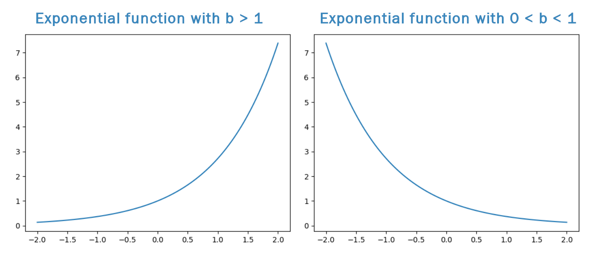
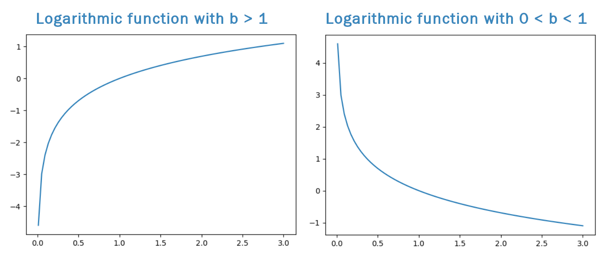
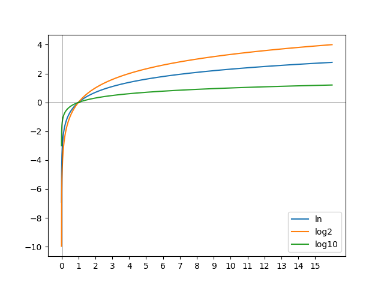

# Functions

[TOC]

A **function** is a relationship between a set of inputs (x_i) and a set of outputs (y_i), where each input corresponds to exactly one output.

The input is also called the **independent variable**, and the output is called the **dependent variable**. 

The input of a function is also called the **argument**.

The set of all possible inputs for the function is called the **domain**, and the set of all possible outputs is called the **range**.

Functions are often written in **function notation**. $$y=f(x)$$ is read as "y equals f of x.' This notation means that y, the dependent variable, is a function of the independent variable x. 

## Representations of functions

Functions can be given through mathematical formulas, tables, graphs, and verbal descriptions. 

The tools of calculus are used on functions that are given as mathematical formulas. As a result, in this course we will see some **modeling functions** - mathematical formulas that fit real-world scenarios expressed through tables of data or visuals.

## Evaluating a function

To evaluate a function at a certain value, we substitute that value for every occurrence of the independent variable. 

For example, to evaluate the function $$f(x)=2x^2−x$$ at $$x=−1\\,$$ we substitute −1 for every x, to get $$f(−1)=2(−1)^2−(−1)=2(1)+1=3\\.$$

# Linear functions

A **linear function** is a function of the form $$f(x)=mx+b\\,$$ where m and b are constants. 

The graph of a linear function is a straight line with slope m and y-intercept (0,b). 

## Calculating slope

If you know the value of a linear function f at two points, x1 and x2, then you can find its **slope** (кутовий коефіцієнт) or **gradient** of a line ([wiki](https://en.wikipedia.org/wiki/Slope)).

$$\boxed{\text{slope} = m = \dfrac{f(x_2) - f(x_1)}{x_2 - x_1}}$$

In general, the slope of a line through two points (x1,y1) and (x2,y2) is given by  $$m = \dfrac{y_2 - y_1}{x_2 - x_1}\\,$$ and often summarized as slope=rise/run. 

The slope of a linear function can be thought of as the **rate of change** in the function. 

## Parallel and perpendicular

**Parallel lines**, lines that never intersect, must have the same slope.

A line that is parallel to a line of slope m has slope m as well. 

**Perpendicular lines** are lines that intersect at a right angle (90∘).

A line that is perpendicular to a line of slope m has slope −1/m.

## Forms for linear functions

There are two main forms used to write equations of lines: **slope-intercept form** and **point-slope form**. 

You can use either form for any line. Depending on the information you have about a line, one form may be quicker to write than the other.

### Slope-Intercept Form

$$\boxed{y = mx + b}$$

m is the slope of the line.

(0,b) is the y-intercept of the line.

### Point-Slope Form

$$\boxed{y - y_0 = m(x - x_0)}$$

m is the slope of the line.

(x0,y0) are the coordinates of any chosen point on the line.

## Functions and models

f: a rule that assigns ∀ x ∈ A → f(x) ∈ B.

ex. sqrt(2)

- Domain: x>=0 (sqrt(2)), [0, ∞]
- Range: y>=0 [0, ∞]

(f(a+h) - f(a)) / h - difference quotient, h ≠ 0

VLT - vertical line test: crosses twice - fails, so it's not a graph of a function.

**Piecewise defined functions**

You use the piece according to what condition is met on the inputs

Ex.
$$
f(x) = \begin{equation}
\begin{cases}
x^2 + 1,\ x \ge 0\\
x,\ x \lt 0
\end{cases}
\end{equation}
$$

- reading right to left.
- first - parabola pushed up 1
- bottom piece: the line goes down to negative infinity forever
- Domain: all Reals
- Range: (-∞, 0) ∪ [1, ∞)

**Symmetry**

Ex. {x x>= 0, -x x<0}

- symmetric about the y axis there
- **the absolute value of a number**
- D: all Reals
- R: [0, ∞)

**Definition**. f(x) is **even** if f(x)=f(-x) <=> y-axis symmetry

> the input of the pos or neg value produces the same output.

Ex. even powers, abs, cos(x).

**Definition**. f(x) is **odd** if f(x) = -f(x) <=> origin symmetry (spinning at 180 degrees)

> negates the entire function

Ex. odd powers (y=x cubed = the  disco function), sin(x)

**Definition**. f is increasing on interval [a, b] if f(x1) > f(x2) whenever x1 > x2 <=> "going up".

**Ex.**

slope = this the change of y over (/) the change of x.

pt-slope formula: y-y1 = m (x-x1)

y =|x| - V or a cusp.

y = x^3 (x cubed) - disco function, it goes low to high.

y = sin x (сайн of x) - sine goes right through the origin, it has a height of 1 & -1 (so it oscillates). Oscillates goes on and on forever and ever D: R, R: [-1, 1]

**Function composition**

You given 2 funcs. You can add them & subtract them, divide as long as the bottom is not zero.

Func. compos. is something that you cannot do with numbers.

**Def**. f * g ("f composed with g" = I take one function and I plug it into another).

(f * g)(x) = f(g(x))

When you're evaluating these things, you read them right to left.

This operation is not commutative! f(g(x)) ≠ g(f(x)). Commutative means order doesn't matter.

$$\sqrt(\sqrt(x)) = x^{1/4}$$

so this becomes x to the one forth.

> Install matplotlib for the next piece of code. Use pip.

Building plot:
```python
from sympy.plotting import *
from sympy import Symbol
x = Symbol("x")
plot(x**2)
plot1 = plot(x**2, (x, -3, 3))
plot1[0].line_color='r' # red color
f1 = 3*x + 2
f2 = x**3
plot(f1, f2)
plot((f1, (x, -10, 0)), (f2, (x, 0, 5)))
```

Example "quadratic calculator":
```python
from numpy import sqrt

from sympy.plotting import *
from sympy import Symbol, true

#ax^2 + bx + c
def zeros(a,b,c):
    D = sqrt(b*b - 4*a*c)
    x1 = (-b + D) / (2*a)
    x2 = (-b - D) / (2*a)

    print("The first root is: ", x1)
    print("The second root is: ", x2)

def printGraph(a,b,c):
    x = Symbol("x")
    plot(a*x**2 + b*x + c)

if __name__ == "__main__":
    while True:
        print("Welcome to our quadratic calculator")
        a = input("Enter a: ");
        b = input("Enter b: ");
        c = input("Enter c: ");
        zeros(float(a), float(b), float(c))
        printGraph(float(a), float(b), float(c))

        allDone = input("Would you like to solve another quadratic? (y/n)")
        if allDone == "n":
            print("Goodbye")
            break
```

## Exponential and logarithmic functions

An **exponential function** has the form $$\boxed{f(x) = a\cdot b^{x}}$$ where b is a positive number and b≠1. b is called the *base*.

### Properties and graph
- Domain: All real numbers, (−∞,∞).
- Range: If a > 0, then the range of f(x)=a⋅b^x is the positive numbers, (0,∞). If a < 0, then the range of f(x) is the negative numbers, (−∞,0).
- Horizontal asymptote: y = 0 (the x axis).
- yyy-intercept: (0,a)(0, a)(0,a)

Suppose a is positive.

If b > 1, then b^x gets bigger as x gets bigger. In this case, the exponential function is increasing.

On the other hand, if 0 < b < 1, then b^x gets smaller as x gets bigger, and the exponential function is decreasing.



> some rules: power of a product (ab)^n & power of a quotient (a/b)^n if a & b are nonnegative (in both cases).

### Natural exponential function

The natural exponential function has base e: $$\boxed{f(x) = e^{x}}$$

The number e, also called Euler's (Ойлер) number, is an irrational constant approximately equal to 2.71828…

## Logarithmic functions

A logarithmic function has the form $\boxed{f(x) = \log_{b}(x)}$, where b is a positive number and b≠1.

b is called the base.

**Logarithmic functions are the inverse of exponential functions**. That is, y=log_⁡b(x) if and only if b^y=x.

Moreover, we have

$$\log_{b}\left( b^{x} \right) = b^{\log_{b}(x)} = x$$

### Properties and graph

- Domain: Positive numbers, (0,∞).
- Range: All real numbers, (−∞,∞).
- Vertical asymptote: x=0 (the y-axis).
- xxx-intercept: (1,0).

If b > 1, then log⁡_b(x) gets bigger as x x gets bigger. In this case, the logarithmic function is increasing.

On the other hand, if 0<b<1, then log⁡_b(x)gets smaller as x gets bigger, and the logarithmic function is decreasing.



> logarithmic rules: b (base) should be > 1; log_a(0) = undefined; $b^{log_bx} = x$ - inverse functions cancel (base logarithmic identity); Change of Base Formula: $\displaystyle \log_{y}(x) = \frac{\log_{b}(x)}{\log_{b}(y)}$.

### Natural Logarithm

The natural logarithm is the logarithm with base e.

It has its own notation: $\log_{e}(x) = \boxed{\ln(x)}$.

Note: log⁡(x), without a base written, is often interpreted to mean the natural logarithm as well.

## Applications

Exponential functions can be used to model quantities that increase or decrease in special ways.

- Exponential Growth: An increasing exponential function grows slowly at first, then more quickly as time goes on. For example, populations usually grow exponentially over time.

- Exponential Decay: A decreasing exponential function shrinks quickly at first, then more slowly as time goes on. For example, air pressure decreases exponentially as altitude increases.

A quantity P that grows exponentially over time can be modeled by the function $P(t) = P_0 e^{kt}$, where P_0 is the initial quantity (when t=0) and k>0. The constant k is called the "rate of growth."

Similarly, a quantity Q that decays exponentially over time can be modeled by the function $Q(t) = Q_0 e^{-kt}$, where Q0 is the initial quantity and k>0. The constant k in this case is called the "rate of decay."

## Some problems

Ex. Find the domain of this function:
$$f(x) = \frac{1-e^x}{1-e^{1-x^2}}$$
$$D: (-\infty;-1) \cup (-1;1) \cup (1; +\infty)$$

Ex. Is this function odd or even?

$$\displaystyle f(x) = \frac{1-e^{1/x}}{1+e^{1/x}}$$
$$\displaystyle f(-x) = \frac{1-1/e^{1/x}}{1+1/e^{1/x}} = \frac{\frac{e^{1/x} - 1}{e^{1/x}}}{\frac{e^{1/x}+1}{e^{1/x}}} = \frac{e^{1/x}-1}{e^{1/x}+1} = \frac{-(1-e^{1/x})}{1+e^{1/x}}$$
$$f(-x) = - f(x)$$
So, this function is  odd.

Ex. Find x.
$$ln(ln x) = 1$$
Exponentiate both sides:
$$e^{ln(lnx)} = e^1$$
$$ln x  = e$$
Exponentiate both sides:
$$e^{ln x}  = e^e$$
$$x  = e^e$$

## Exponents and Logarithms in SymPy

Declare:
```python
b, x = symbols('b x')

b**x -> b**x     # how to obtain an exponential function
exp(x) -> exp(x) # e^x
log(b, x) -> log(b)/log(x) # returns the change of base formula
# Leaving off the second parameter and simply writing 
# log(x) results in the natural logarithm. 
ln(x) -> log(x) # can also be used for the natural log
# Evaluating:
# Set the expression equal to e squared
expr = exp(2)
# Evaluate as a floating point number
expr.evalf() -> 7.38905609893065
expr = exp(E)
expr.evalf() -> 15.154206823694174 (e^e)

```

### Simplifying exponentials
Recall the exponential properties, Multiplication Property (b^n x b^p), Power Property ((b^n)^p, where p is an int), Power of a Product (a^n x b^n).

SymPy's functions to simplify exponentials only work if the simplification works for all possible values of the symbols. By default, there are no assumptions about symbols (they are assumed to be complex numbers, the set that includes all real numbers as well as the square roots of negative numbers). To add assumptions, we add parameters to the symbols() function.

```python
# Let p be an integer
p = symbols('p', integer=True)
# Let n be a real number
n = symbols('n', real=True)
# Let a and b be positive
a, b = symbols('a b', positive=True)
```

When the required assumptions hold, the following SymPy functions can be used to simplify exponential expressions.

- powsimp() applies the Multiplication Property and the Power of a Product Property, from left to right. This results in a shorter expression, hence "simp" for simplify.
- expand_power_exp() applies the Multiplication Property from right to left. This results in a longer expression, hence "expand."
- expand_power_base() applies the Power of a Product from right to left. This results in a longer expression, hence "expand."
- powdenest() applies the Power Property from left to right.

### Simplifying logarithms

Recall the logarithm properties, Product Property (ln(x*y)), Log of a Power (ln(x^n)).

As with exponents, we must make sure the necessary assumptions hold before we can simplify.

```python
# Let x and y be positive
x, y = symbols('x y', positive=True)
# Let n be a real number
n = symbols('n', real=True)
```

Then the following SymPy functions can be used to simplify logarithmic expressions.

- expand_log() applies the two properties from left to right (expanding the expression).

- logcombine() applies the two properties from right to left (making the expression more compact).

## Solving Equations in SymPy

We can use SymPy to solve equations for variables. 

```python
x = symbols('x')
Eq(5*x + 3, 1)  # creates an equation 1 = 5x + 3
solveset(Eq(5*x + 3, 1), x) -> {-2/5} # solved for x
solveset(Eq(x**2, 1), x) -> {-1, 1}
# solveset() automatically assumes that any expression not in an Eq() is equal to zero. 
# Thus, we could reduce the number of parentheses in the previous 
# example by expressing the equation the following way:
solveset(x**2 - 1, x)

```

### Domains for solutions

As noted in the "Exponents and Logarithms in SymPy" reading, SymPy generally assumes that symbols are complex numbers. In this class, we are dealing only with real numbers.

Exponential and logarithmic functions behave differently with complex numbers. For this reason, solving an exponential or logarithmic equation in SymPy can yield some strange-looking results.

For example, consider the equation 2^x=8. We expect the answer x=3. But, solveset() does not give us this answer. Instead, we get a ConditionSet.

```python
x = symbols('x')
solveset(Eq(2**x, 8), x)
-> ConditionSet(x, Eq(2**x - 8, 0), Complexes((-oo, oo) x (-oo, oo), False))
```

To keep this from happening, we can set the domain for solutions x to be real numbers only. We do this by adding the argument domain = S.Reals to solveset().

```python
x = symbols('x')
solveset(Eq(2**x, 8), x, domain = S.Reals)
-> {log(8)/log(2)}
```

### solve()

There is another SymPy function, solve(equation, x)

SymPy documentation recommends using solveset(). However, in cases where solveset() does not work, solve() can be used with the same syntax.

## Working with math and building graphs
```python
import math
math.exp(1)
2.71
# natural log:
math.log(10)
# to change the base
math.log(10, 5) # 5 is the base
math.log10(4.34) # base 10
math.log
```

```python
import numpy as np
import matplotlib.pyplot as plt
import math

def create_graph():
    x = np.linspace(0.001, 16, 2000)
    y_e = np.log(x)    # y = ln(x)
    y_2 = np.log2(x)   # y = log_2(x)
    y_10 = np.log10(x) # y = log(x)
    
    plt.plot(x, y_e)
    plt.plot(x, y_2)
    plt.plot(x, y_10)
    
    plt.legend(['ln', 'log2', 'log10'], loc='lower right')
    plt.xticks(range(math.floor(min(x)), math.ceil(max(x))))
    plt.axhline(color='black', linewidth=0.5)
    plt.axvline(color='black', linewidth=0.5)
    plt.show()

create_graph()
```
Gives us:


Log function to count numbers in the number:
```python
import math

def digitCounter(n):
    return int(math.log10(n) + 1)
```

