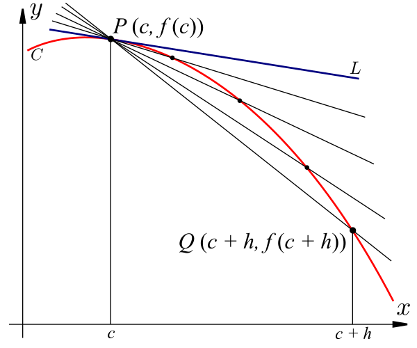

# Limits and Rates of Change

List comprehensions and SymPy functions.

```python
number_list = [0, -1, 5, -2.7, 5.9, 0, 4.1]
# let x be a symbol
x = symbols('x')
# define the function f(x)
f = x**2 + 2*x + 1
# define list comprehension
f_list = [f.subs(x, i) for i in number_list]
print(f_list)
```

## Limits 

Limits are tools to overcome the division by 0, a problem where algebra fails.

Suppose a function f(x) is defined on some open interval containing the point a. When we discuss the **limit** of f as x approaches a, we are examining the behavior of the function values f(x) as the value x gets closer and closer to a.

> You don't need f to be defined to take a limit.

There are two possible directions to approach a along the x-axis, so correspondingly there are two different one-sided limits. If on both sides, the function values f(x) approach the same number L, then we write

$$\displaystyle\boxed{\lim_{x\to a}f(x) = L}$$

which is read 'the limit of f(x), as x approaches a, equals L.'

## Rates of Change

The **average rate of change** of the function f(x) over the interval x=a to x=b is $\displaystyle\frac{\Delta f}{\Delta x} = \frac{f(b) - f(a)}{b - a}​$

The **instantaneous rate of change** of a function f(x) at x=c is the limit of the average rates of change of f over shorter and shorter intervals containing c.

The instantaneous rate of change of f at x=c is also called the **derivative**, and denoted by f'(c).

Limit def. of the der.:
$$\displaystyle f'(c) = \lim_{h\to 0} \frac{f(c+h) - f(c)}{h}$$.
[c,c+h] is an interval containing c. As h goes to 0, the interval gets shorter and shorter.

### Visualizing rates of change

The average rate of change from x=a to x=b is the slope of the line between (a, f(a)) and (b, f(b)). Such a line, intersecting the graph of a function at two points, is called a **secant line** (січна). 

Consider the point P (c, f(c)) on the graph of f. For some positive value of h, let Q be another point on the graph, (c+h,f(c+h)). Then draw the secant line between P and Q. 

As h gets smaller and smaller, the point Q gets closer and closer to the point P, and the secant line between P and Q gets closer and closer to the **tangent line to the graph of f at P**. This is the line that touches the graph of f at the point P, and has the same slope as the graph of f at that point.



In summary,

- **Average rate of change** over an interval = slope of a secant line between two points.
- **Instantaneous rate of change** at a value = slope of a tangent line at a point.

## Some problems

Ex. f(x) = sin (Pi/x)

> f is going bananas as you get closer to 0 if oscillates infinitely many times.

f(0) = undefined

$$\displaystyle \lim_{x \to 0} f(x) = DNE$$

> this limit does not exist. -1 <-> +1.

You can find limits by plugging in (when possible).

## Vertical asymptote

> "+" - from the right<br>"-" - from the left

Def.: the line x=a is a vertical asymptote of y=f(x) if at least 1 of the following is true:

$\displaystyle \lim_{x \to a} f(x) = \pm \infty$ or $\displaystyle \lim_{x \to a^-} f(x) = \pm \infty$ or $\displaystyle \lim_{x \to a^+} f(x) = \pm \infty$

x -> $\infty$. Describe the behaviour? Can you touch asymptote? YES.

For an overall $\lim_{x \to a} f(x)$ to exist, it must be the same value L if you approach from the right or from the left.

$\displaystyle \lim_{x \to a} f(x) = L$ <=> $\displaystyle \lim_{x \to a^-} f(x) = L$ and $\displaystyle \lim_{x \to a^+} f(x) = L$

## Limits and Rates of Change in SymPy

Estimating a limit:

Ex.

$$\displaystyle\lim_{x\to 2}\frac{x^2 - x - 2}{x - 2}$$

We make a list of x-values approaching 2 from the left and from the right. Then, use list comprehension to obtain the corresponding list of function values.

```python
x = symbols('x')
# define the function f
f = (x**2 - x - 2)/(x - 2)
# make a list of values approaching 2 from the left and right
x_values = [1.9, 1.99, 1.999, 2.001, 2.01, 2.1]
# use list comprehension to make a list of function values
f_values = [f.subs(x, i) for i in x_values]
print(f_values)

# [2.90000000000000, 2.98999999999998, 2.99899999999986, 3.00100000000014, 3.00999999999998, 3.10000000000000]
```

We see that the values of f are getting close to 3 as x gets closer to 2, so we can estimate that the limit equals 3.

We can also use SymPy to find the exact value of a limit.

```python
x = symbols('x')
limit((x**2 - x - 2)/(x - 2), x, 2)
# 3
```

∞ is written as oo in SymPy.
```python
x = symbols('x')
limit(exp(x), x, oo)
```

Let's compute the instantaneous rate of change of $f(x) = e^{x^2}$ at x=1.

```python
x, h = symbols('x, h')
# Write symbolic expression for the function
f_x = exp(x**2)
# Substitute for f(1 + h)
f_1h = f_x.subs(x, 1 + h)
# Substitute for f(1)
f_1 = f_x.subs(x, 1)
# Limit for instantaneous rate of change at 1
iroc1 = limit((f_1h -f_1)/h, h, 0)
print(iroc1)
iroc1.evalf()

# 2*E
# 5.43656365691809
```

One sided limits:
```python
L = limit(f, x, 0, "-")
L = limit(f, x, 0, "+")
```

## Sample problems

## Sample problem 1

The table below gives the average hourly earnings H(t) for a production worker in the year t.
...

(a) Find the slope of the secant line to the graph of H(t) on between the points t=1970 and t=1980. Interpret the meaning of this slope.

(b) Find the slope of the secant lines to the graph of H(t) between t=1975 and t=1980, t=1980 and t=1985, t=1980 and t=1990, t=1980 and t=1995, and t=1980 and t=2000.

(c) Use slopes of secant lines to estimate the slope of the tangent line to the graph of H(t) at the point t=1980. Interpret the meaning of this slope.

```python
# Hint: Use list comprehension
t_H_values = [(1970, 3.40), (1975, 4.73), (1980, 6.84), (1985, 8.73), (1990, 10.09), (1995, 11.64), (2000, 14.00)]
x = [i[0] for i in t_H_values]
y = [i[1] for i in t_H_values]
slope_secant = []
# a
slope_secant.append((y[2] - y[0])/(x[2] - x[0]))
print(slope_secant)
# 0.344
# b
secant_slopes = [(6.84 - y)/(1980 - x) for (x, y) in t_H_values]
print(secant_slopes)
# [0.344,0.4219999999999999,0.3780000000000001,0.325,0.32000000000000006,0.358]
```

c: Use slopes of secant lines to estimate the slope of the tangent line to the graph of H(t) at the point t=1980. Interpret the meaning of this slope.

. . .

The slope of the tangent line to the graph of H(t) at t=1980 corresponds to the instantaneous rate of change in H(t) at that point. The slope of the tangent line is the limit of the slopes of secant lines (average rates of change) between (t,H(t) and 1980,H(1980)) as t gets closer and closer to 1980.

In the answer for part (b), the year gets closer to t=1980 in the middle of the list. Comparing values, we can estimate that the slope of the tangent line a t=1980 is somewhere between 0.378 and 0.325.  Note that we can't find the exact value, only an estimate. A good guess could be $\boxed{0.35}$.

This slope tells us that in the year 1980, the hourly wage of a production worker was increasing at rate of about 0.350 dollars per year.

### Sample problem 2

The size T of a tumor (in cubic millimeters) x months after it is discovered by a doctor is given by the function $T(x)=0.9e^{0.7x}$.

(a) Find the average rate of change in the size of the tumor over the first three months.

(b) How fast is the tumor growing three months after it is discovered?

(c) Compute the limit of T(x) as x goes to infinity. What does this limit tell us about the function and the tumor?

```python
x = symbols('x')
t = 0.9*exp(0.7*x)
# a
avg_rate_of_change_of_3m = (t.subs(x, 3) - t.subs(x, 0)) / 3
print(avg_rate_of_change_of_3m)
# 2.14985097377029
# Over the first three months, the tumor grew at an average rate 
# of about 2.152.152.15 cubic millimeters per month.
# b
h = symbols('h')
f1_h = t.subs(x, 3 + h)
f1   = t.subs(x, 3)
inst_rate_of_change_of_3m = limit((f1_h - f1)/h, h, 0)
print(inst_rate_of_change_of_3m)
# 5.14468704491762
# This tells us that 333 months after the tumor is discovered,
# it is growing at a rate of about 5.145.145.14 cubic millimeters per month.
# Comparing this with the average rate of change from the previous part, 
# we see that the tumor is growing at a faster and faster rate as time goes on.
lim_to_inf = limit(t, x, S.Infinity)
print(lim_to_inf)
# oo
# This tells us that there are no bounds on the function representing the tumor's growth. 
# According to the function, the tumor will eventually become infinitely large.
# In contrast, realistically, the tumor's growth will probably slow at some point.
# Thus, we might say that the function T(x) is only a good representation of the tumor's
# size within a certain time period. Many months after the tumor was discovered, 
# there would likely be a better function to model its growth.
```
