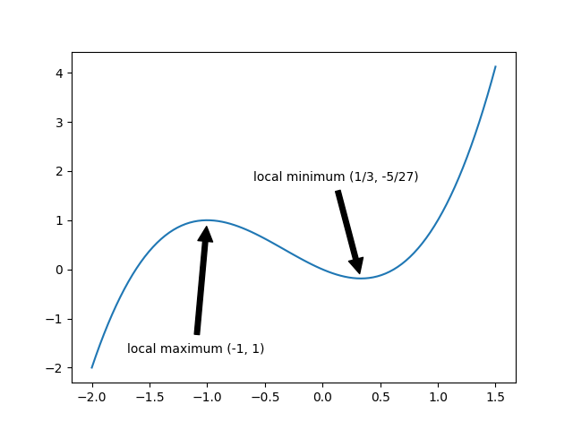

# Using the Derivative

**Def**. The normal line to a curve C at pt P is the line through P that is perpendicular to the tangent line. 

From geomentry:  
if l1 ⟂ l2, m1 = -1/m2 (negative reciprocal of line two) or, in other words, if two lines are perpendicular, the slopes are negative reciprocals. (The product of the slopes = -1.)

**Def**. $\displaystyle\lim_{h \to 0}(\frac{e^h - 1}{h}) = 1$, e is the base that makes this true.

## Rules

1. Const multiple rule
2. Sum & difference rule
3. Quotient rule

$$\frac{d}{dx}[f(x)/g(x)] = \frac{g(x) \frac{d}{dx}f(x) - f(x)\frac{d}{dx}g(x)}{[g(x)]^2}$$

4. Product rule

$$\frac{d}{dx}[f(x)\cdot g(x)] = f(x) \cdot g'(x) + g(x) \cdot f'(x)$$

5. Chain rule

$$F'(x) = \frac{d}{dx} f(g(x)) = f'(g(x)) \cdot g'(x)$$

$$(L): \frac{dy}{dx} = \frac{dy}{du} \cdot \frac{du}{dx}$$


## Maxima and Minima

**Definition.** Let x0 be a number in the domain D of a function f(x). Then

- f(x0) is the **global maximum value** (absolute max value) of f on D if f(x0)≥f(x) for all x in D.
- f(x0) is the **global minimum value** (absolute min value) of f on D if f(x0)≤f(x) for all x in D.
- f(x0) is a **local maximum value** of f if f(x0)≥f(x) when x is near x0.
- f(x0) is a **local minimum value** of f if f(x0)≤f(x) when x is near x0.

Maxima and minima are collectively called **extrema**.

The process of finding global maximum and minimum values is called **optimization.**

Global extrema are sometimes called *absolute* extrema. Local extrema are sometimes called *relative* extrema.

Note that a function may have many local extrema. On the other hand, a function can have at most one global maximum and at most one global minimum.

For example, the function f(x) = x^3 + x^2 - x is graphed below.



Going left to right, the function increases until it reaches a local maximum value at the point (-1, 1). Then, the function begins to decrease, until it reaches a local minimum value at (0.333, -0.185). After that, the function increases again.

The function has local maximum value f(−1)=1. It also has a local minimum value, $f\left(\frac13\right) = -\frac{5}{27} \approx -0.185$. 

However, note that function attains infinitely high and low values, so it does not have an absolute maximum or an absolute minimum on its domain.

Note also that, depending on a problem, you may want to locate an *extremum*, or an *extreme value*. The former can be identified by a value of the variable, while the latter refers to the function value. For example, we could say the function f(x) above has a local maximum *at* x=−1, and attains a local maximum *value* of 1.

**The Extreme Value Theorem** (EVT)  
if f(x) is continuous on [a,b], then f(x) attains (досягає) an absolute max value f(c) and absolute minimum value f(d) for some c, d in [a,b].  
This theorem:  

- powerful b/c it provides guarantees
- useless b/c it doesn't tell you how to find those values.

> This is where Fermat's theorem comes in handy.

## Critical Points

**Definition.** A **critical point** is a point c in the domain of the function f(x)  such that either f′(c)=0 or f′(c)=DNE.

Critical points are also called **critical numbers**.

Critical points give us a way to find extrema of a function without graphing. We refer to the following theorem.

**Fermat's Theorem.** If the function f has a local maximum or minimum at x0, then x0 is a critical point of f.

> notes: if f(x) has a local max or local min at c, and if f'(c) exists, then f'(c) = 0.

Note that the converse of Fermat's Theorem *does not hold*. **Every maximum or minimum is a critical number, but not every critical number is a maximum or minimum.**

For example, if f(x) = x^3, then 0 = f'(x) = 3x^2 at x=0. However, f(0)=0 is neither a maximum nor a minimum of f.

The critical points give us all possible candidates for local maxima and minima. The next step is to classify each critical point as a local maximum, a local minimum, or neither.

## The First Derivative Test

Recall that the first derivative tells us whether a function is increasing or decreasing on an interval.

- If f′(x)>0 on an interval, then f(x) is **increasing** on that interval.
- If f′(x)<0 on an interval, then f(x) is **decreasing** on that interval.

To reach a local maximum, a function must increase to the maximum value, then decrease afterwards. Similarly, to reach a local minimum, the function must decrease until it achieves the minimum value, then begin to increase again.

This gives us the following test to classify critical points.

**The First Derivative Test.**

Let f(x) be a differentiable func. with (w|) critical number x0, then we have the following observations:

- If f′ changes **from positive to negative** at x0, then f has a local **maximum** at x0.
- If f′ changes **from negative to positive** at x0, then f has a local **minimum** at x0.
- If f′ does not change sign to the left or right of x0, then f has no local extremum at x0.

### Process for finding local extrema

To find local extrema of a function f(x), use the following steps.

1. Find the derivative f′(x).
2. Locate all points (if any) where f′(x) is undefined - these are critical points.
3. Set f′(x)=0 and solve for x - these are the rest of the critical points.
4. Divide the domain of f(x) into subintervals using the critical points. 
5. Choose a sample point in each subinterval and test the value of f′(x) at that point. The sign of f′(x) at the sample point (positive or negative) is the sign of f′(x) on the entire subinterval.
6. Classify critical points:
   1. Any critical points where f(x) is defined and  f′(x) changes from positive to negative are local maxima.
   2. Any critical points where f(x) is defined and  f′(x) changes from negative to positive are local minima.

Note that you should confirm that f(x) is defined at a point before saying it is a local extremum. This is because, in order for the point to be a maximum or minimum, it must be a point on the graph.

## The Closed Interval Method

If we restrict our view to a *closed interval* (an interval which includes both of its endpoints), then we can find an absolute maximum and absolute minimum for a function.

The steps for finding the absolute maximum and minimum values of a differentiable function f(x) on a closed interval [a,b] are as follows.

**The Closed Interval Method.** 

1. **Find critical points.** Identify points where f′ does not exist to find critical points. Then solve f′(x)=0 for x to find more critical points.
2. **Find function values at critical points.** Evaluate the function value f(x) at each of the critical points you found.
3. **Find function values at endpoints.** Evaluate the function values at the endpoints of the interval, f(a) and f(b).
4. **Compare values.** Compare the values computed in the previous steps. The highest value is the absolute maximum, and the lowest value is the absolute minimum.

# Concavity and Inflection Points (Увігнутість і точки перегину)

A function's **second derivative** tells us about the **concavity** of its graph. **Second Derivative Test**:

- If f′′(x)>0  (f'(x) is increasing) on an interval, then f(x) is **concave up** (вгнута) on that interval.
- If f′′(x)<0 (f'(x) is decreasing) on an interval, then f(x) is **concave down** (опукла) on that interval.

Ex.  When -1, 2 are inflection points of the f(x) = x^4 - 2x^3 - 12^2 + 5.  
Conc up: (-$\infty$, 1) U (2, $\infty$)  
Conc do: (-1, 2)

A graph that is concave up bends upward, and a graph that is concave down bends downward, as shown below.


**Definition.** An **inflection point** (точка перегину) is a point x0 where both f(x0) and f′(x0) are defined, and at which f changes from concave upward to downward, or from concave downward to upward.

> from notes: Let c $\in$ (a,b) be an inflection pt of f(x) if f(x) changes concavity at x=c.  
It's all related via the mean value theorem. And here is sort of the relationship to the 1st der. and 2nd der.:   
f(x) is conc up iff f' inc iff f''>0  
f(x) is conc do iff f' dec iff f''<0  

To find inflection points for a function f(x), we use the following process;

1. Find the second derivative f′′(x).
2. Locate all points (if any) where f′′(x) is undefined - these are some possible inflection points.
3. Set f′′(x)=0 and solve for x - these are the rest of the possible inflection points.
4. Divide the domain of f(x) into subintervals using the possible inflection points.
5. Choose a sample point in each subinterval and test the value of f′′(x) at that point. The sign of f′′(x) at the sample point (positive or negative) is the sign of f′′(x) on the entire subinterval.
6. Determine at which points the second derivative changed sign (positive to negative, or negative to positive).
7. From that list, the points where f and f′ are defined are the inflection points.

Note that you should confirm that f and f′ are defined at a point before you can say it is an inflection point. f must be defined so that the point is actually on the graph. f′ must be defined so that the graph smoothly changes concavity - for example, a sharp corner or a break in the graph cannot be considered an inflection point.

## Local Extrema Calculator

```python
from sympy import *
from sympy.parsing.sympy_parser import parse_expr

def Local_Extreme_Calculator(f, x):
  x = Symbol("x")
  j = 0
  # ...
  # find f'
  print("The derivative is ", dy)
  # find critical values
  print("The critical values are x = ", critical_points)
  # check if max/min using 2nd der test
  d2f = Derivative(f, x, 2).doit()
  # review 2nd der test:
  for i in critical_points:
    cp = d2f.subs({x:critical_points[j]}).evalf()
    if (cp > 0):
      print("x = ", critical_points[j].evalf(3), " is a local minimum")
      y = parse_expr(f).subs({x:critical_points[j]}).evalf()
      float(y)
      minList.append(y)
   else (cp==0):
     print("unable to determine if ", cp, " is min or max")
   else:
     #....
   j=j+1
  # find local min/max:
  print("local max(s) of f(x) = ", f, " is " maxList)
  #same for min

if __name__ == "__main__":
  f = input("Enter a function: ")
  x = input("Enter the variable to differentiate with respect to: ")
  Local_Extreme_Calculator(f, x)
```

## Optimization word problems

General algorithm:

1. Convert information to math expressions.

> You want to enclose a rectangular garden in your yard. You have 200 feet of fencing. What is the largest area that you can enclose?
A = lw  
l+w = 100

2. Write the quantity to be optimized as a function of one variable.  

> A(w) = 100w - w^2. The domain is [0,100] - w cannot be negative + we only have 200 feet.

3. Find critical points for the function.

> A'(w)=0. w=50 is the critical point

4. Classify critical points with the First Derivative Test or the Closed Interval Method.

> Since this function is defined on a closed interval [0,100], we can use the Closed Interval Method.  
A(0)=0, A(50)=2500, A(100)=0. Therefore, the maximum area is A(50)=2500 square feet.

## Using the Derivative with SymPy

### Finding Local Extrema With SymPy

Recall the algorithm here.

We can use SymPy to make calculations for this process.

- Use the diff() function to take the derivative.
- Use solveset() to solve for critical points. `solveset(f_prime,x)`
- Divide the domain as usual.

> To finish the problem, we choose a sample point from each of the intervals x<−1, −1<x<1/3, and x>1/3​. For example, we could consider the points x=−2, x=0, and x=1. `sample=[-2,0,1]`

- Use the subs() function with a list comprehension to compute derivative values at sample points. `sample_values=[f_prime.subs(x, i) for i in sample]`.
- Classify critical points as usual.

### Finding Global Extrema With SymPy

Recall the Closed Interval Method to find global extrema on a closed interval.

We can also translate this method into SymPy steps:

- Use the diff() function to take the derivative.
- Use solveset() to solve for critical points.
- Create a list containing the critical points and interval endpoints.
- Use the subs() function with a list comprehension to compute derivative values at critical points and endpoints.
- Compare values to find global maximum and minimum.

### Increase, Decrease, and Concavity

We can use similar methods with list comprehension to quickly find intervals where a function is increasing, decreasing, concave up, or concave down. 

## Sample problems

**Sample problem 1**

```python
x = symbols('x')
f_x = log(x**2 + x + 1)
# a - find all critical numbers of f
df = diff(f_x, x, 1)
print(solveset(df, x))
# -1/2 is the only critical number
# b - find the intervals where f is increasing
#      and the intervals where f is decreasing.
sample = [-1, 0]
sample_values = [df.subs(x, i) for i in sample]
print(sample_values)
# [-1, 1]
# so, f has local minimum at -1/2
# - f(x) decr: (-\infty, -1/2)
# - f(x) incr: (-1/2, \infty)
# c - find the intervals where f is concave up
#      and the intervals where f is concave down.
d2 = diff(f_x, x, 2)
solved_d2 = list(solveset(d2, x))
solved_d2.sort()
print(solved_d2)
# [-sqrt(3)/2 - 1/2, -1/2 + sqrt(3)/2]
sample = [solved_d2[0] - 1, solved_d2[0] + 1,
          solved_d2[1] - 1, solved_d2[1] + 1]
sample
print(sample)
sample_values = [d2.subs(x, i) for i in sample]
print(sample_values)
for v in sample_values:
    if v > 0:
        print("+")
    elif v < 0:
        print("-")
# - + + -
# or I could use these points:
# f_prime2.subs(x, -10)
# f_prime2.subs(x, 0)
# f_prime2.subs(x, 10)
# Concave up:  (-sqrt(3)/2 - 1/2, -1/2 + sqrt(3)/2)
# Concave down:(-\infty, -sqrt(3)/2 - 1/2) U (-1/2 + sqrt(3)/2, \infty) 
# d - Classify the critical numbers of f.
# f has local minimum at -1/2
```

**Sample problem 2** Critical Points vs. Inflection Points. 

A city's traffic bureau tracks the number of cars that pass through a busy intersection each hour. From 5:00 AM to 7:00 AM, the number of cars that passed through the intersection each hour rose faster and faster. From 7:00 AM to 9:00 AM, the number of cars passing through the intersection each hour still rose, but more and more slowly. Then, the number of cars passing through the intersection decreased steadily from 9:00 AM to 11:00 AM.

Let the integer t denote hours since midnight, and let the function N(t) represent the number of cars that passed through the intersection in the hour between time t−1 and time t.

Classify each time as an inflection point or critical point of N(t).

(a) t=7
(b) t=9

**Sample Problem 3**. Profit, Revenue, and Cost.

A company’s revenue from selling xxx items is given by the function R(x)=360x−x^2. The cost associated with selling x items is given by C(x)=12x+64. 

Find the number of items which maximizes the profit for the company. 

You may use SymPy to make calculations.

