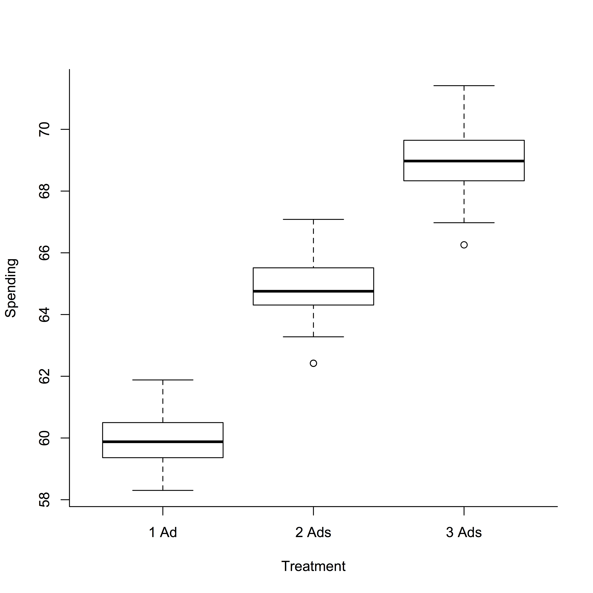
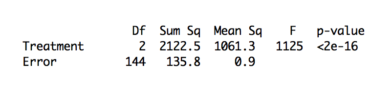

# Stanford Introduction to Statistics

[TOC]

## Introduction to the course

Statistics is the science of learning from data. 

The course will help me to develop the skills I need to analyze data and to communicate my findings.

Broadly, there r 3 main reasons why statistical literacy is essential in Data Science:

1. It provides the skills to assess whether the data are sufficient to answer the questions at hand.
2. It establishes a rigorous framework for quantifying uncertainty.
3. It provides techniques for effectively communicating the findings of your analyses.

Guenther Walther is a professor in the Department of Statistics at Stanford University. Research-wise, he has worked in a range of areas from investigating puzzlin behavior in solar neutrinos,to extracting information from many measurements of single cells in high-throughput biological experiments, to developing new statistical methodology.

## Descriptive Statistics and Visualizing information

For data that a *qualitative* (e.g. colors, car types,...) use a pie chart or a dot plot. 

**Pie chart**

- depicts a pie where each slice is sliced according to the corresponding percentage
- allows more easily to eyeball what fraction of the total a category corresponds to

**Dot plot**

- each horizontal line corresponds to one category; the pos. of the dot corresponds to the %
- makes it easier to compare frequencies of various categories (when you can't compare almost identical frequencies on a pie chart)

**Bar graph**

- when the data are *quantitative* (i.e. numbers), then they should be put on a number line, b/c the ordering and the distance between the numbers convey important information.
- bar g = a dot plot put on its side

**Histogram**

- shows areas of blocks which are proportional to frequency. In other words, area corresponds to %
- Out of a histogram, you can get two kinds of the information: 
  - density (crowding, look at the Y axis)
  - frequencies. In order to compute frequencies, you should compute the areas of the blocks respectively using the following formula: area = height x width. Or you can just look at the X axis and try to guess.

**Boxplot** (box-and-wisker plot)

- depicts five key numbers of data
- conveys less info but takes less space, so you can compare several datasets!
- |---|   |   |-----| left-to-right:
  - upper whisker is the largest number in the data
  - 3rd quartile is the n where a quarter of the data are larger and three-quarters are smaller
  - median is the number where half of the data are smaller and half are greater
  - 1st quartile quartile is the n where a quarter of the data are smaller and three-quarters are larger
  - lower whisker is the smallest number in the data

By putting all three boxplots in one graphic, we see that the miles per gallon are larger for cars that have fewer cylinders.

**Scatterplot**

- depicts data that comes as *pairs*.
- it visualizes the relationship btw 2 vars.

Q: about the good represantation of a bad 3D graph.

A: Just a regular bar graph, where the X axis contains names of the Universities, and the Y axis contains the amount of money each University got.

## Numerical summary measures

Summarizing the data with 1 num: mean (=average) or the median

median = a midpoint, half r larger, half r smaller

What should we use?

mean = median when the histogram is symmetric

When the right side of histogram is much longer than the left side the histogram is called *skewed to the right* (перекошена вправо). It means the mean can be much larger than the median! It is better to use the median for such histograms.

4 parts divided by 25th percentile (1st quartile), 50th percentile (the median, <span>&#36;</span>50 000), 75th percentile (3rd quartile, <span>&#36;</span>85 000).

Q: How would you describe the 25th percentile on the example of household income, if you know that the 25th percentile corresponds with a specific number X? 

A: The top 75 percent reported income greater than X.
Correct: One way to put it is to say "25 % of households report an income of X or less, 75 % report more". 

> Back to the boxplot.

The **interquartile range** = 3rd quartile - 1st quartile

It measures how spread out the data are.

A more commonly used measure of spread is **stddev**.

The mean and the stddev are often used to summarize data:

- $\bar{x}$ mean gives a measure of center
- s gives u a measure of spread
- both are sensitive to a few large or small data. If that a concern (especially when the histo is very skewed), use the median and the interquartile range.

Q: Assuming you have data including house prices in some particular city, what could you potentially use the standard deviation for? Select all that apply.

A: 

- If you wanted to know how different the prices in the particular city are.
- If you wanted to know whether all the prices are around the average.
- Looking at two parts of the city, you notice that the average price is actually the same. You would like to know if the data also looks the same / similarly.

## Quiz

Q: According to the histogram of travel times to work from the US 2000 census (Page 6 of "Journey to Work: 2000"), roughly what percentage of commuters travel more than 45 minutes?

A: 14.75

> (7.9+6.3+5.8+4.2+3.3+2.0)/2

According to the histogram of travel times to work from the US 2000 census (Page 6 of "Journey to Work: 2000"), approximately what is the median travel time, in minutes (i.e. 50% of commuters have at most that travel time, 50% have at least that travel time)?

A: 24 (correct)

> I looked at the men's proportionas from the top of the figure and started to add them until I got >= 50. The last proportion was 24 minutes.

↑ household income by 5%:

- mean   - goes up by 5%
- median - goes up by 5%
- stddev - goes up by 5%
- interquartile range - goes up by 5%

↑ household income by <span>&#36;</span>5000:

- mean   - goes up by 5%
- median - goes up by 5%
- stddev - doen't change
- interquartile range - doesn't change

Q: The median sales price for houses in a certain county during the last year was <span>&#36;</span>342,000. What can we say about the percentage of sales represented by the houses that sold for more than <span>&#36;</span>342,000?

A: the houses that sold for more than <span>&#36;</span>342,000 represent more than 50% of all sales (wrong)

A: the houses that sold for more than <span>&#36;</span>342,000 represent exactly 50% of all sales. (correct!)

## Producing Data & Sampling

Statistical inference?

**Population**: the entire group of subjects about which we want information.

> all U.S. voters

**Parameter**: the quantity about the population we are interested

> Approval percentage among all U.S. voters.

**Sample**: the part of the population from which we collect info.

> the 1000 voters selected at random

**Statistic (estimate)**: the quantity we are interested in as measured in the sample.

> approval percentage among the sampled voters

Key point: even a relatively small sample will produce an estimate that is close to the param. of a very large population of 250 mil. subjects.

How exactly we would sample those 1000 voters at random?

Sample 1000 voters in your hometown - sample of convenience. Not a good way to sample b/c the voter will be different from the popul. of the country. Voters on the West Coast & East Coast - Democratic, Midwest - more Republican.

This will introduce bias, i.e. sampling will favor a certain outcome.

Q: Imagine you are working for a large retail company. You would like to see how your customers like the new product your company launched a month ago. Your colleague suggests that you can go to a shopping center in the weekend to collect the reviews. What bias(es) could result from this decision?

A:

1. Selection bias

> You will collect reviews from customers who are present in the specific shopping center, but your customers are likely in many other places, potentially having completely different experiences (e.g. shopping online or in some other states or a country). 

2. Non-response bias

> You will likely get a portion of population who spends at least part of that particular weekend in the shopping center. 

3. Voluntary response bias

> If you are not careful, you might get only reviews from customers who had very good or very bad experiences.

In order to avoid bias, use chance in a planned way:

- simple random sample  - at random without replacement
- stratified random sample - divide the pop. into groups of similar subjects called strata (e.g.urban, suburban, and rural voeters). Then one chooses a simple r s in each stratum & combines these

sample at random gives that the estimate will be different from the parameter due to chance error

estimate = parameter (close to this) + bias (sample not done well)+ chance error (unavoidable)

chance error is unavoidable, but it gets smaller when the sample size gets bigger

this is not the case for bias (systematic error): increasing sample size repeats the error on a larger scale, and typic. we don't know how large the bias is.

confouding factors (sometimes =lurking variable)

'The weird power of the placebo effect, explained' by Brian Resnick (7/7/2017)

Randomization makes sure that influences other than treatment influence both treatment and control group equally.

## Quiz

Q: A news company located next to Times Square in New York wants to get a sense how people feel about a proposed law on immigration. A reporter steps out of the building and randomly selects 100 people walking there and asks them about the proposed law. What can we say about this sampling plan? Single correct answer.

A: it leads to selection bias.

Q: A car company wants to get a sense how satisfied the owners of its new car model are with the quality of that car. It randomly selects 250 numbers from the all the vehicle registration numbers that have been issued for this model and contacts the owners of that model. What can we say about this sampling plan?

A: it represents a simple random sampling

Q: An airline wants to do a customer survey in order to improve its service. For one month, it sends an email to a random sample of customers which flew with the airline on the previous day (no customer will be contacted more than once). The email states that the airline would like the customer to fill out a 10 minute survey in order to help the airline improve its service. What can we say about this sampling plan? Single correct answer.

A: it leads to non-response bias

> People whose time is more valuable or more limited are less likely to respond. 

Q: As in the previous question, an airline wants to do a customer survey in order to improve its service. For one month, it sends an email to a random sample of customers which flew with the airline on the previous day (no customer will be contacted more than once). Again, the email states that the airline would like the customer to fill out a 10 minute survey in order to help the airline improve its service, but this time it states in addition that every respondent will receive a gift card worth <span>&#36;</span>100. What can we say about this sampling plan?

A: It leads to non-response bias

> It will likely result in less bias than the previous question.

Q: Question 5

Some years ago, there were many news reports about the "Paleo diet". It was claimed that the Paleo Diet would result in weight loss as well as prevention and control of many "diseases of civilization".
 

A news channel decides to check this out. It recruits people who have followed the diet for the past year and selects 100 at random. It also recruits people who have not followed the diet and selects 100 at random. It finds that there is more weight loss in the diet group, and that this result is 'statistically significant'.
 

Which of the following statements are true?

A: It is possible that the difference in weight loss is due to the placebo effect.

> It's an observational study as the subjects are not randomized into treatment and control.

> Since this is an observational study, there may be other confounders besides the placebo effect. For example, people who start the paleo diet are likely to have a healthier lifestyle in general.

Q: A number of competitive female cross country runners suffer from bone loss due to the low estrogen levels. Some medical experts conjecture that this can be prevented by taking oral contraceptives, as those contain estrogen. This conjecture is to be tested with an experiment. The goal of the experiment is to find out whether taking an oral contraceptive prevents bone loss in female cross country runners. Which of the following subjects should be recruited in order to do a good experiment? (Pick one of the three.)

A: A group of female runners who are not taking oral contraceptives, but who are willing to take them if asked by the organizers of the experiment to do do.

> This is the way you gain more control over your experiment.

## Probability

4 rules:

- complement rule
- rule for equally likely outcomes: # of outcomes in A / n.
- if A and B are mutually exclusive, then

$$ P (A\ or\ B) = P(A) + P(B) $$

> mutually exclusive: getting A=1 and getting B=6 on a first roll.

- multiplication rule: if A and B are independent, then

$$ P (A\ and\ B) = P(A) \cdot P(B) $$

> independent: if knowing that one occurs does not change the p that the other occurs. Ex. A=1 on a first die, B=6 on a second roll.

**Ex**. dice -> 3 times. P(at least 1 six)?

P(at least 1 six) = 1 - P (no six in 3 roles) = 1 - 5/6 * 5/6 * 5/6.

General multiplication rule:

$$ P(A\ and\ B) = P(A) \cdot P(B|A) $$

General multiplication rule when A and B are _independent_:

$$ P(A\ and\ B) = P(A) \cdot P(B) $$

**Ex**. "Spam filter"

$$ P(money\ appears) = P(money\ and\ spam) + P(money\ and\ ham) $$
$$ = P(spam) \cdot P(money|spam) + P(ham) \cdot P(money|ham) $$
$$ = 0.2 \cdot 0.08 + 0.01 \cdot 0.8 = 0.24 = 2.4\% $$

**Bayes rule**

$$\displaystyle P(B|A) = \frac{P(A|B) \cdot P(B)}{P(A)}= \frac{P(A|B) \cdot P(B)}{P(A|B) \cdot P(B) + P(A|not\ B)\cdot P(not\ B)}$$

Bayes rule describes the p of an event, taking into account prior knowledge of conditions that might be related to the event.

**Bayesian analysis**

- befor examining the e-mail, p(spam) = 20%.
- after examining the e-mail for certain keywords ("money"), the filter updates the prior p using the Bayes' rule tot arrive at the _posterior p_ that the e-mail is spam.

**Ex**. "False positives"

- disease = D
- positive test = +
- "false positive" means P(+|no disease) = 0.02

$$\displaystyle P(D|+) = \frac{0.95 \cdot 0.01}{0.95 \cdot 0.01 + 0.02 \cdot 0.99} = 32.4\%$$

Q: Given what you just learned about false positives, how would you define a false negative? Can you think of an example?

A: It's an opposite of the false positives. So, it's the probability that a person that has a disease, tests negative: P(-| no D).

## Quiz

Q: A multiple choice exam has 10 questions. Each question has 3 possible answers, of which one is correct. A student knows the correct answers to 4 questions and guesses the answers to the other 6 questions.

It turns out that the student answered the first question correctly. What are the chances that the student was merely guessing?

A:

With "g" for "guess", "k" for "know", and "cor" for "correct:

$$\displaystyle P(g|cor) = \frac{P(g\ and\ cor)}{P(cor)} = \frac{P(cor|g)P(g)}{P(cor)} = \frac{P(cor|g)P(g)}{P(cor|g)P(g)+P(cor|k)P(k)}$$

$$\displaystyle = \frac{1/3 \cdot 6/10}{1/3\cdot 6/10 + 1 \cdot 4/10}$$

(The numerical answer is 1/3.)

Q: There are three boxes on the table: The first box contains 2 quarters, the second box contains 2 nickels, and the last box contains 1 quarter and 1 nickel. You choose a box at random, then you pick a coin at random from the chosen box.
 

If the coin you picked is a quarter, what's the chance that the other coin in the box is also a quarter?

With "qq" for "quarter-quater box", "qn" for "quarter-nickel" box, and "q" for "picked a quarter":

$$\displaystyle P(qq|q) = \frac {P(qq\ and\ q)}{P(q)} = \frac{P(q|qq)P(qq)}{P(q)} = \frac{P(q|qq)P(qq)}{P(q|qq)P(qq)+P(q|qn)P(qn)}$$

$$\displaystyle = \frac{1/1 \cdot 1/3}{1/1\cdot 1/3 + 1/2 \cdot 1/3}$$

Note that the rightmost denominator could also have been written

$$P(q|qq)P(qq) + P(q∣qn)P(qn) + P(q∣nn)P(nn)$$
where "nn" stands for "nickel-nickel box", but then P(q∣nn)=0.

(The numerical answer is 2/32/32/3.)

## Normal Approximation

Empirical rule:

- 2/3~68% lies in 1 stddev of the mean
- 95% lies in 2 stddev of the mean
- 99.7 lies in 3 stddev of the mean.

Normal ~:

1. standardize: find z=(value-mean)/s
2. mark on the graph
3. write the desired in a form that can be computed by software or looked up in a table (typically we look for the area to the left of a given value)
4. use software or a table to find values

You can use the empirical rule, b/c it's a special case of normal ~.

Q: If you know that -0.1 corresponds to approximately 46 % and 1.8 corresponds to approximately 96.4 % (both percentages are areas under the curve to the left of the value), what percentage of fathers will have heights between 68.1 inc and 71.5 in?

A: The answer is 50.4%: 96.4-46 to find the area btw the values.

## Binomial distributions

Binomial setting:

- _independent repetitions_ of an experiment (I think they are also "with replacement", b/c we've done an experiment and doing a new one with the same objects)
- each experiment has 2 pos. outcomes: success, failure.
- p of succ is the same in each experiment

This setting is also defined by listing all the possibilities (total enumeration).

Binomial coefficient (# of ways one can arrange k successes in n experiments): $\displaystyle \left( \frac{n}{k} \right)$

$\displaystyle p(\text{ k successes in n experiments }) =  \left( \frac{n}{k} \right ) \cdot p^k \cdot (1-p)^{n-k}$

X = "# of successes" - random variable
P(X=2) = 30.2%, X has the binomial distribution. We can vis. the ps of the var. outcomes of X with a prob. histogram (it's a theoret. construct, so it's not observed data from a typical histogram).

as n experiments $\uparrow$, the p histo of the binom distribution looks more and more similar to the normal curve. We can use normal~:  standirdize, - off np, divide by sqrt(np(1-p)).

**About Sampling, again**

A simple random sample (as in polls) selects subjects without replacement (without replacement means the same item cannot be selected more than once + items are dependent) (вибір без повернення). This is not binom. setting, b/c p changes after a subject has been removed.

> https://www.statisticshowto.com/sampling-with-replacement-without/

population $\uparrow$, sampling with repl. ~ sampling without. So, the # of successes will have ~ binom. distrib (~ follow the normal curve). You can use normal ~ in that case.

## Quiz

Q: Scores on a certain test follow the normal curve with an average of 1350 and a standard deviation of 120.

What percentage of test takers score below 1230?  (Use the empirical rule.) 

A: ~~68%~~

> Consider the percentage of cases that fall under the first, second, and third standard deviation.

A: 16%

Q: Question 2

As in the previous question, scores on a certain test follow the normal curve with an average of 1350 and a standard deviation of 120.

 In order to qualify for a certain job, a candidate needs to score in the top 2.5%. What score does she need?

A: 1590

Q: Recall that the main object in a boxplot is a box that is bounded by the first and the third quartiles. So the length of the box is the difference between the third and the first quartile, which is called the interquartile range. This is a measure of spread of the data; it is sometimes used as an alternative to the standard deviation.  

If the data follow the normal curve, then the interquartile range equals how many standard deviations? (You may use the fact that the z-value of the third quartile is 0.7.)

~~A: 2. We know that it's standerdized, so s=1, mean=0. However, we need to find the interquartile range: s*2 = 2.~~

A: 1.4

> Since the z-value of the third quartile tells us its distance to the left or right of the mean, measured in standard deviations, we are told that the third quartile is 0.7 standard deviations to the right of the mean. By symmetry, this means that the first quartile is 0.7 to the left of the mean, and the distance between the two quartiles is 2(0.7) = 1.4.

Q: A multiple choice exam has 5 questions. Each question has 4 possible answers, of which one is correct. If a student guesses the answers to all five questions, what the chances that he gets 2 correct?

A: 

$$
\frac{5!}{3!2!} \cdot \left(\frac{1}{4}\right)^2 \cdot \left(\frac{3}{4}\right)^3
$$

Q: A fair coin is tossed 6 times. What are the chances of getting 2 tails in each the first 3 and the last 3 tosses?

A: 

$$
\displaystyle{ 
\left(\frac{3!}{2!1!}\left(\frac{1}{2}\right)^3\right)+\left(\frac{3!}{2!1!}\left(\frac{1}{2}\right)^3\right)
 = 2\left(\frac{3}{8}\right) }
$$

> This is wrong.

A: 
$$
\displaystyle{ 
\left(\frac{3!}{2!1!}\left(\frac{1}{2}\right)^3\right) \cdot \left(\frac{3!}{2!1!}\left(\frac{1}{2}\right)^3\right)
 = \left(\frac{3}{8}\right)^2}
$$

With a fair coin, any specific sequence of n tosses will have probability $(\frac{1}{2})^n$, so the probability of a specific sequence of 3 tosses is $(\frac{1}{2})^3$.  The number of 3-toss sequences with 2 tails and 1 one head is $\frac{3!}{2!1!}=3$, so the probability of getting exactly 2 tails in the first 3 of 6 six tosses is $\frac{3}{8}$. The probability getting exactly 2 tails in the last 3 of 6 six tosses is the same, so the probability of getting them in both the first 3 and last 3 tosses is the square.

(Numerically, this gives us 9/64=0.1406, or 14.06%14.06\%14.06%.)


> Use one of the formulas you learned in this module. Consider the probabilities of 3-toss sequences with 2 tails and 1 head.

Q: Question 6

A fair coin is tossed 400 times. Approximately what are the chances to get more than 210 tails?  (Use the empirical rule and the normal approximation to the binomial distribution.)

A: P(n(T)>210), but first let's find P(n(T)<=210):

- standardize: (210 - 200*0.5) / sqrt(400*0.5*.0.5) = 10/10 = 1
- according to the table z=1, P(n(T)<=210) = 0.84.
- apply the complement rule here: P(n(T)>210) = 1 - P(n(T)<=210) = 1 - 0.84 = 0.16= 16%.

> From the normal approximation to a binomial distribution for 400 trials and 1/2 probability of success, the mean number of successes is 400(1/2) = 200, and the standard deviation is the square root of 400(1/2)(1/2), which is 10. So 210 successes is one standard deviation above the mean. From the empirical rule, one half of 68% of the data lies within one standard deviation to the right of the mean, so 50% + (1/2)68% = 84% of the data lies to the left of 210.  That is, 16% percent of the data lies to right of 210.

## The expected value, SE, and Sampling Distribution of a Statistic

The expected value Mu is a quantity of interest parameter (not a statistic (estimate)) about the population average, which can be an expected value of 1 random draw, and an expected value of the sample average (xn).

The mu and xn are close, but they are not the same. xn is a random variable, and it can be different from sample to sample. The Standard Error (SE) tells roughly how far off the statistic will be from the expected value.

$$SE(\bar x_n) = \frac{\sigma}{\sqrt(n)}$$

## Quiz

Q: Question 1

 A town has 10,000 registered voters, of whom 6,000 are voting for the Democratic party. A survey organization is taking a sample of 100 registered voters (assume sampling with replacement). The percentage of Democratic voters in the sample will be around _____, give or take ____. (You may use the fact that the standard deviation of 6,000  1s and 4,000 0s is about 0.5)

A: 60%, give or take 5%: 

- E(percentage of 1s) = 1* 0.6 *100 = 60%
- SE(percentage of 1s) = sigma/sqrt(n) * 100 =0.5/10 * 100 = 5%

The percentage of Democratic voters in the sample is equal to the mean of the sample, and so the "around" value is the expected value of the sample mean, which in turn is equal to the population mean, 0.60 or 60%.  

Similarly, the "give or take" value is the standard error of the mean, which is equal to $\frac{\sigma}{\sqrt{n}}$, where σ is the standard deviation of the population and n is the size of the sample.  We're told that sigma is about 0.5 and n is 100, so the standard error of the mean is 0.05 or 5%.

Q: Question 2

You solicit 100 pledges for a charitable organization. Each pledge is equally likely to be $10, $50, or $100. You may use the fact that the standard deviation of the three amounts $10, $50 and $100 is $37.

What is the expected value of the sum of the 100 pledges?

A: `$`5333

The expected value of the sum of a sample is nμ, where n is the size of the sample and μ is the mean of the population. Here we're told that n is 100 and μ must be the average of $10, $50, and $100, which is = 10*1/3 + 50*1/3 + 100*1/3= $53.33, so the expected value of the sample sum is 100*53.33 = $5333.

Q: You solicit 100 pledges for a charitable organization. Each pledge is equally likely to be $10, $50, or $100. You may use the fact that the standard deviation of the three amounts $10, $50 and $100 is $37.

What are the chances that the 100 pledges total more than $5,700 ?

A: 16%

We are using the normal approximation.

> is P appropriate here?

P(100 pl > 5700) = 100 - P(100 pl <= 5700)

SE(S100) = sigma * sqrt(n) = 37*10 = 370

5333+370 = 5703 in 1 stddev, so 2/3~68% lies in stddev. 68/2=34% to the right of the mean.

P(100 pl <= 5700) = 50% + 34% = 84%

P(100pl > 5700) = 100% - 84% = 16%


The standard error of the sample sum is $sqrt{n}\sigma$, where n is the sample size and σ is the standard deviation of the population. Since n is 100 and we're told that the standard deviation of the population is `$`37, we know the standard error of the sample sum is `$`370. Using the normal approximation to the sampling distribution, this tells us that $5700 is roughly one standard deviation (5700 - 5333 = 366) above the mean of the sampling distribution. From the empirical rule, we know that one half of 68% of the data lies within one standard deviation to the right of the mean, so that 50 + (1/2)68 = 84% of the data lies to the left of `$`5700.  That is, 16% percent of the data lies to right of `$`5700.

Q: Question 4

There are two candidates running for governor in CA and they are said to have roughly equal support from the voters. To get a better idea who is ahead, a company polls 400 of the 20 million registered voters in California. Likewise, there are two candidates running for mayor in Palo Alto who are said to have roughly equal support, and the company polls 400 out of the 20,000 registered voters in Palo Alto.  Will the first poll be more accurate, equally accurate, or less accurate than the second poll?

A: equally accurate

The standard error is the same since it depends on the size of the sample, not the size of the population.

Q: The average taxable income reported on tax returns for the year 2016 is `$` 45,000, and the standard deviation of the taxable incomes is `$` 23,000. 

Which of the following two statements are true? Both?

A: ~~The percentage of taxable incomes that fall below `$` 30,000 can be computed from the above information using normal approximation.~~

> The histogram of incomes is skewed and not normal. This statement is about that histogram.

A: The chances that the sum of 100 randomly selected taxable incomes exceeds $ 4 million can be computed from the above information using normal approximation.

> The central limit theorem applies to the sum of 100 draws.

Q: Questions (a)-(d) below relate to the following situation: Someone tosses a fair coin 100 times.

Question (a): How many tails can she expect to get?

A: 50

mu = 1 * 1/2  + 0 * 1/2 = 0.5

E(S100) = n * mu = 100 * 0.5 = 50

The expected value of the number of successes in  n binomial experiments with probability of success p is np, which in this case is 100(1/2).

Q: Question (b): What is the "give and take" number for the result from Question (a)?

A: The standard error of the number of successes in n binomial experiments with probability of success p is $\sqrt{np(1-p)}$, which in this case is $\sqrt{100(1/2)(1/2)}$.

Q: Question (c): What are the chances that she gets between 40 and 60 tails?

A: 95%

From Questions (a) and (b), the expected number of successes is 50 and its standard error is 5, so that using the normal approximation, the values in the range 40-60 are within 2 standard deviations of the mean. The empirical rule then gives that 95% of the data falls in this range.


Q: A large group of people get together and everyone tosses a coin 100 times.

Question (d): About what percentage of people will get between 40 and 60 tails?

A: 95%

From Question (c), the probability that the number of successes in a run of 100 binomial experiments will be between 40 and 60 is 95%.  But this just means that we expect 95 out of every 100 such runs of 100 binomial experiments to each yield a total number of successes that is between 40 and 60.   In other words, we expect this will be true for 95% of people.

## Regression

### Correlation

r is only useful for measuring *linear association*. r є [-1,1]. Sign is a direction of the association. |r| - strength

- r =-1: slopes downward, points are tightly clustered on the line
- r = 1: slopes upward, points are tightly clustered on the line
- r = 0: the scatter is spread out, no linear association btw 2 variables.

Q: You are working on a project analyzing the association between age and the number of hair products. You come across data showing that these two variables are correlated with r=+0,1. What would you conclude?

A: Two variables are positively correlated - the higher the age, the higher the number of hair products. You conclude that there is a very weak linear relationship between these two variables. 

Q: How do you expect the data to look like if you plot them on X-axis "age", Y-axis "number of hair products"?

A: There will be almost no perceptible uphill or downhill trend.

### Inference in Regression

Another interpretation of the regression line: it computes the avg(y) (y-) when the first coordinate is near x.  

Remember, the idea in statistics is that often times an average is the 'best' predictor! This shows how the r. line incorporates the info given by x to produce good predict. of x.

Q: What does the "squares" in the method of least squares refer to?

A: Squares of vertical differences between the observed point and the regression line

$$ \hat y = a + bx$$

Q: Try to guess - What value would you enter for "a" in this equation?

A: Intercept - the expected mean value of Y when X=0, in other words, the value at which the regression line crosses the Y-axis.

b = r* (sy/sx) означає, що якщо х одне стандартне відхилення sx вище x-, то тоді прогнозоване значення y^ тільки r*sy вище y-. 

Прогноз "до середнього": Y^ знаходиться менше стандартних відхилень від y- ніж x від x-.

Регресійний ефект може спостерігатися в football-shaped в діаграмах розсіювання (пр. результати екзаменів). 
In such a test-retest situation, the top group on the test would drop down somewhat on the retest, and the bottom group moves up.

It's important to realize that this is simply an effect of the scatter around the line.
Sometimes, people look at that effect and conclude that there must be something else going on. For example, the conclusion might be that the top scorers on the midterm slackened off and did worse on the final. Such an erroneous conclusion is called the **regression fallacy**.

Q: How would you define the regression effect?

A: The **regression affect** or regression to the mean is when "things will even out over time". If we are taking test, then our score might be defined as score = ability + chance (or luck). If we scored high first time, then there is no guarantee that the next test (retest) we would have the same luck. That's our prediction. We would approach the mean, or, you can say, the average performance.

Look at the example from Students that were good at midterms appears below the line (right hand side). Their final exam scores < top scores which are above the line. Regression towards the mean makes sense: we predict that top scores on the midterm will be below the top on the final exam.

#### Normal approximation given x

If the scatter plot is football-shaped, we can use the normal ~ for the y-values conditional on x:

- so we have x, we can predict y simply by looking at the p that falls on the line BUT
- y-values of pairs that near x, follow the normal curve. Use normal ~ for those y-values.
- We need to know the centre & the scale of the normal curve

To standardize (x-y^)/(sy*sqrt(1-r^2)).

You found z, use software to find out what % of the data (y-values) appears above (or below) some value y (you standardized it to z). Remember that it's all "conditional on x" (near x), so some value x gives you an x-axis for your plot of the normal curve.

Q: Remember that for "standardization" you use the following formula: (X – μ) / σ, where X is your observation, μ is the mean and σ is the standard deviation. In this example, it would be (41 – 49.5) / 10.2 = –0.83

Now, what would be the predicted final exam score of a student who scored 58 on the midterm?

A: 75.7

```python
b = 0.67*11.8/10.2
y_cap = (69.1 - b*49.5) + b*58
print(y_cap)
# 75.68833333333333 or simplified version
z_x = (58-49.5)/10.2
y_cap = 69.1 + 0.67 * 11.8 * z_x # _final + r*sy*(X-_midterm)/s_mid
print(y_cap)
# 75.68833333333333
```

Q: Why is the normal approximation useful for linear regression?

A: The normal approximation gives us a way to compute y-values of pairs that near x, because they follow the normal curve. For example, it is useful when we try to find out what % of students around some X score on the test scored above some y-value on the retest.


### Residuals


ei = yi - yi^ - residuals (залишки). To check whether the use of regression is appropriate. Build a plot x/residuals. It should show an unstructured horiz. bar. Regression isn't approp. if the plot follows the curved pattern. Appropriate: if there is not structure and points are just inside a horizontal band.

You can use regression when the scatter plot is not linear. Transform the data:

- regress sqrt(y-values) or log(y-values) on x-values
- sometimes it results in a linear pattern and we can apply regression.
- and then we would simply transform back the results

Q: What is a residual? Select all that apply.

A: 

- It is the difference between observed and predicted y-values.
- It is the vertical distance between a data point (yi) and the regression line (yi^).

heteroscedastic - a fan shape, opens up. It shows on a typical plot and the residual plot:

- a little bit variability on the left-side
- a lot of variability on the right-side

Those types of problems can be fixed by transforming the y-values. However, those transformations of the y-values may produce homeoscedastic scatter (equal spread). You may get a non-linear scatter if you apply a second transformation on x-values! Ex. Election of 2000, you are taking log of y and log of x. You get a log log plot and we get a residual plot that is satisfactory.

Outlier - point with large residual. E.g. typo, phenomena. You can see them clearly on the residual plot (not only on a typical one).

x is far from x- has **high leverage** (it may change the regression line): через одну точку лінія регресії може відхилитися від x-.

Whether x does change the line a lot (we call it an influential p) or not can only be defined by refiting the r. line without that point. An infl. p may have a small residual (b/c it's influen.), so a resid. plot is not helpful for this analysis

Other issues:

- avoid predicting y by extrapolating (do not go beyond the boundaries of the interval)
- beware of data that r summaries (x-1, x-2, ..., x-n). Less variable than individ. observatiosn & cor. btw averages tend to overstate the strength of the relationship.
- r. a. repors R^2 = r^2: gives a fraction of the variation in the y-values that is explained by r. l. (1-r^2 is the f. of the var. of y-values that is left in the residuals)


Q: You are running a regression analysis. As part of the analysis, you plot residuals of your data and notice that your plot looks like a cone - that the variability changes with x values. There is not much variability on the left side, but there is a lot of data variability on the right side. What do you conclude?

A: The linear regression is not appropriate as it is, but you might still be able to fix that by transforming your data.

Q: Imagine that you have a business and that you conducted a survey with your customers. You are looking at the results. What could be an example of an outlier in your data? Select all that apply.

A: 

- Data point for a person who buys your product much more often than others in the survey.
- A typo in the data.
- Data point for a person who misunderstood your survey question.
Correct
- Data point for a person who is actually not your customer.

Q: You are reading the news and see a result of an experiment with R-squared of 20 %. What would you conclude?

A: That the data is probably very scattered and that the regression line is not doing a very good job in explaining y-values. The effect seems to be very weak.

## Quiz

Question 1

Some people believe that musical activity (e.g. playing an instrument) enhances mathematical ability. 100 high school students were selected at random. For each student, musical activity was recorded in hours per week and mathematical ability was assessed by a test. The correlation coefficient was found to be 0.85.

Does the large correlation coefficient prove that musical activity enhances mathematical ability?

A: No

> The high correlation indicates a relationship between hours per week dedicated to musical activity and score on a math test, but doesn't explain the nature of the relationship. For example, older students may dedicate more time to music and receive higher scores on the math test than younger students, in which case age would be a confounder.

Question 2

What would your answer to the previous question be if you learned that all students in the study came from the same grade?

A: No

There could be other confounders, such as level of parental involvement.

Question 3

For a group of commuters commuting to work on a given day, the correlation coefficient between a) time spent waiting at traffic signals, and  b) total commuting time, was found to be 0.4.  Which of the following statements about the correlation coefficient are true?

A: 

- The more time a commuter spends waiting at traffic signals, the longer the total commuting time, on average.
- The more time a commuter spends commuting to work, the more time he spends waiting at traffic signals, on average.

Question 4

A study followed 1,000 children over time. The scatter plot of heights at age 1 vs. heights at age 2 looks football-shaped with a correlation coefficient r=0.8. Alice's height at age 1 is at the 80th percentile.

Would you predict her height at age 2 to be below, at, or above the 80th percentile?

A: 

~~At~~

> Consider the regression effect.

Below

Question 5

In the previous question we learned that in a study of children's height,  the correlation coefficient between height at age 1 vs. height at age 2 is r=0.8.

Predict the z-score of Alice's height at age 2. (You may use the fact that the z-score of the 80th percentile is z=0.85.)

A: 

~~not enough information~~

> Consider the regression line of standardized data.

A: r * zx = 0.8 * 0.85

y^ = y- + z * sy * zx

(y^-y-)/s_y = r*zx

zy = r*zx


Questions (a)-(d) below relate to the following situation:  In a biology class, both the midterm scores and the final exam scores have an average of 50 and a standard deviation of 10. The scatterplot looks football-shaped and the correlation coefficient is 0.6.  

Claudia would like to know what score her friend Emily got on the final.

Question (a): If you have no information on how Emily did on the midterm, what is your prediction for her score on the final?


A:

~~56~~

> Refer to the videos on Inference in Regression if you need refresh.

~~ 44

> Refer to the videos on Inference in Regression if you need refresh.

A:

50

> Without Emily's midterm score, we would just use the average final score as our prediction of Emily's final score. LOL

Question (b):  What is the "give or take" number for your prediction from Question (a)?

A:

~~10(0.6)=6~~

> Remember that we are only considering information about the final scores in our prediction.

~~10sqrt(1−(0.6)^2)​=8~~

> Remember that we are only considering information about the final scores in our prediction.

10

> Since we're only considering information about the final scores in our prediction, just as our predicted score is the average final score, our "give or "take" number is the standard deviation of the final scores.

Question 8

Now you learn that Emily got exactly the mean score of 50 on the midterm.

Question (c):  Given this information, what is your prediction for Emily's score on the final?

A: 50 

zx = (50-50)/10 = 0

zy = r*zx = 0

> Since the distance in standard deviations of Emily's midterm score from the average midterm score is 0, the corresponding distance of Emily's predicted final score from the average final score is r * 0 = 0, so that our prediction is unchanged.

Question (d):  What is the "give or take" number for your prediction from Question (c)?

A: 

~~10~~

> Refer to the videos on Inference in Regression if you need refresh.

10sqrt(1−(0.6)^2)​=8

> I think it's because we are using standardized values.

> Since we're told the scatterplot of midterm scores vs. final scores is football-shaped, we assume we can use the normal approximation to estimate the standard deviation of the final scores for any fixed midterm score by $s_y\sqrt{1-r^2}$

Question 10

A tutoring center advertises its services by stating that students who sign up improve their GPA on tests by 0.5 points on average. 

Is this indeed evidence that the tutoring helps or could this be due to the regression effect?

A: The improvement could be due to the regression effect.

(not The improvement proves that the tutoring helps.)

> Tutoring may attract mostly struggling students.

Question 11

True or false: If an observation with large leverage has a small residual, then it is not influential.

A: False

> An observation may have a small residual because it is influential.


## Confidence intervals

Q: What will be the standard error if mu (60%) and sigma stay the same (0.49), but the sample size is increased (from 1000) to 5000 people?

A: The standard error would decrease to 0.7 %.

Q: How would you define confidence intervals? What would a confidence interval of 99 percent mean?

A confidence interval is a range of plausible values for the unknown population percentage (mu). Suppose we already know SE(%). We just need to find the sample percentage (%). Our value mu will be between (%-2SE) and (%+2SE) if we are interested in a 95% confidence interval.

99% confidence interval mean that 99% of the time I'm correct about that the population percentage (mu) is somewhere in that range.

Q: What can be said about the bootstrap principle? Select all that apply.


A: 

- It helps us when we don't know the standard deviation of the population. 
- We can estimate sigma from the sample - we use the sample standard deviation instead of the population standard deviation.

Q: What would be our 95 % confidence interval, if we poll 1000 likely voters and find that only 20 % approve the way the president handles his job?

A: [17.5 % , 22.5 %]: [20 - 2*SE*100, 20+2*SE*100], where SE = SE = math.sqrt(0.2*0.8)/math.sqrt(1000)

We can use the bootstrap principle to estimate the measurement error.

Q: What could you do to decrease the margin of error - the width of the confidence interval?

A: 

- increase the sample size n
- lower the confidence level (e.g. 80%)


## Quiz

Q: A random sample of 500 sales prices of recently purchased homes in a county is taken. From that sample a 90% confidence interval for the average sales price of all homes in the county is computed to be $215,000 +/- $35,000.
 
Is the following statement true or false?

"About 90% of all home sales in the county have a sales price in the range $215,000 +/- $35,000."

A: false

> A confidence interval is a statement about a sampling distribution; in our case, the sampling distribution of average values of all samples of size 500. The statement instead refers to the data the samples are being taken from, and not the averages of these samples. We would say "we can be 90% confident that home sales in the county have a sales price in the range...".

Q: Question 2

A random sample of 500 sales prices of recently purchased homes in a county is taken. From that sample a 90% confidence interval for the average sales price of all homes in the county is computed to be $215,000 +/- $35,000.
 
Is the following statement: true or false?
 
"There is a 90% chance that the average sales price of all homes in the county is in the range $215,000 +/- $35,000."

A: false

> The average price of all houses is not a random value: It is certain to be in the interval or is certain not to be, so we can't talk about chance.

Q: A poll of 400 eligible voters in a city finds that 313 plan to vote in the next election. Find a 95% confidence interval for the percentage of all eligible voters in the city who plan to vote.

A: 100[400/313​±sqrt(​(313/400​)(1−313​/400)​​)/2400]

Q: Question 4

Questions (a) and (b) below relate to the following: Based on a sample of 500 salaries in a large city we want to find a confidence interval for the average salary in that city.

Question (a): Is it possible to do this using the formula "average +/- z SE"?  (Keep in mind that the histogram of salaries is not normal but quite skewed.)

A: yes

> The central limit theorem tells us that the distribution of averages of samples of salaries is close to a normal distribution even if the distribution of all salaries is quite skewed.

Q: Question 5

The margin of error for the confidence interval from Question (a), which was based on 500 salaries, turns out to be $5,400. How many salaries do we need to sample in order to shrink the margin of error to about $2,000?

A: (5400⋅2000)^2⋅500=3645

Q: Question 6

You are interested what the current starting salary for jobs in data science is. You solicit feedback on an online forum about data science and you get 230 replies with salary numbers. Can you use the formula "average +/- z SE" to find a confidence interval for the average starting salary?

A: no

> The replies are not a random sample of the starting salaries of forum participants. In addition, the sample is not being drawn from the population of all people who work in data science, but only from the population of all forum participants.


## Testing Hypothesis

Q: Your company develops a new product. You are in charge of sales and would like to know if selling the product as a multipack would positively influence product profit. You decide to run an experiment. What is your null hypothesis?

H0: selling the product as a multipack doesn't influence its sales

> The null hypothesis says that selling the product as a multipack doesn't have any influence on the product profit.

What would be your alternative hypothesis?

HA: selling the product as a multipack does have a positive influence on the product profit.

> Selling the product as a multipack has a non-zero effect on the product profit.

Q: What would happen if the student correctly guessed 9 out of 10 cups? We looked up the p-values for you. 

A: 

```python
from statistics import NormalDist
z = (9-5)/1.58
# 2.53
(1-NormalDist(mu=5,sigma=1.58).cdf(9))*100
# 0.5676434117424911
```

z = 2.53, p-value=0.0057, the result is statistically significant

Q: You conducted a two-sided test. You calculate the p-value on the right side of the distribution plot, and it's 0.026. What do you conclude?

A: You double it to 0.052, and conclude that the result is not statistically significant for the significance level of 5 %.


Q: When do you think you could use a sign-test?

A: 

- To test if a diet is working - compare the weight of subjects before and after the diet.
- To test if COVID had any influence on students' scores - compare the scores of students before and during COVID.
- To test if a new type of swimming suit has any influence on the performance of swimmers - compare the speed of swimming wearing the usual swimsuit and with the speed of swimming wearing the new type of swimsuit.

## Quiz

Question 1

Which of the following statements are true? (Select all that apply.)

A: 

- The p-value depends on the data.
- If the null hypothesis is true, then there is less than a 5% chance to get a p-value that is smaller than 5%.
- If a data scientist does many tests, then even if all the null hypotheses are true, a certain proportion will be rejected in error.

> A p-value is a measure of the chance of witnessing the observed data assuming that the null hypothesis is true.

> To say that an event is unlikely assuming a null hypothesis is true does not mean it's impossible under that assumption: Unlikely events can and do occur.

Question 2 

Read the first five paragraphs of the article "Online daters do better in the marriage stakes" by Regina Nuzzo in Nature News, 2013. The main claim of the article is that there is a statistically significant difference in marital outcomes between couples that meet online and couples that meet in other ways. Is this finding is of practical relevance?

A: no

> Because a result is statistically significant does not have to mean it is practically relevant: The difference between 92% and 94% is not practically relevant.

Question 3

A fair coin is tossed 100 times.

Which of the following statements are true?  (Select all that apply.)


A: 

- The standard error for the percentage of heads among the 100 tosses is 5%.
- The standard error for the percentage of tails among the 100100100 tosses is 5%5\%5%.

BUT not: The standard error for the quantity "percentage of heads - percentage of tails" is $\sqrt{0.05^2 + 0.05^2} = 7\%$.

> The percentage of heads and the percentage of tails are not independent.

Question 4:

Is there a relationship between age and insomnia?  A random sample of 184 people ages 18-29 was taken, and it was found that 26.1% suffer from insomnia and 73.9% do not. A separate random sample of 811 people ages 30 and over was taken, and it was found that 39.2% suffer from insomnia and 60.8% do not.

Which of the following four test statistics are appropriate for testing whether the prevalence of insomnia is different between the two age groups? (Select all that are.)

A:

z=​(0.261−0.392​)/sqrt(0.261(1−0.261)​/184+0.392(1−0.392)/811​)

> This is the correct 2-sample zzz-test.

Question 5

You want to test whether plain M&Ms really contain 24% blue M&Ms as claimed on the manufacturer's web site. You sample 500 plain M&Ms at random and count the fraction of blue M&Ms.

Which of the following tests is appropriate to address this question?

A;

- z-test

> The z-test is appropriate since we're testing a proportion or percentage.

Question 6

A high school principal wants to find out whether the average SAT score of this year's graduating class is higher than last year's. She samples 13 students from this year's graduating class at random and wants to compare their average SAT score to the average SAT score from last year's graduating class.

A: t-test

> Because the question doesn't suggest or imply a clear choice for the standard deviation of the population, it requires us to use the sample standard deviation. This and the fact that the sample size is less than 20 means that our use of the sample standard deviation could lead us to draw invalid conclusions 
from the normal approximation used to apply the z-test.  In this small-sample-size context, the t-test is more appropriate.

~~sign test or paired-difference test~~

> The question involves only one sample.

Question 7

To investigate whether there is a difference in scholastic abilities between first-borns and second-born siblings, 600 families that have at least two children were randomly selected. The scholastic abilities of the first-born and the second-born siblings were assessed with a test and are to be compared.

A:

- sign test
- paired-difference test.

> Because the natural units of the question are sibling pairs, the sign test is appropriate but not as sensitive as the paired-difference test.

> Because the natural units of the question are sibling pairs, the paired-difference test is the most appropriate.


## Using computer simulations in place of calculations

Computer simulations are helpful when we are interested in an estimator for some parameter, but we cannot use the normal approximation.

Q: Which statements are true about the Monte Carlo Method?

A: 

- It is based on random sampling.
- Using the law of large numbers, we can draw samples many times, and get more accurate approximations.
- It can be used for computing the standard error. 

~~It's helpful only if we know the average and standard deviation in the population.~~

Q: The Bootstrap principle makes Monte Carlo possible only in situations when we can draw as many samples as we wish.

A: False 

> It's possible even when you can't draw as many samples as you wish.

Q: To use the bootstrap principle, we need to do the following (select all that apply):

1. Draw a sample from the population. 
2. Draw bootstrap samples from the sample.
3. Compute the estimator for each of the samples.
4. Use the copies of estimators to approximate the value of interest.

Q: What is the difference between nonparametric and parametric bootstrap? 

A: 

- Nonparametric bootstrap means simulating samples X1*, ..., Xn* by drawing with replacement from X1, ..., Xn.
- Parametric bootstrap means simulating samples from a normal distribution, using estimates for the unknown parameters.

Q: When is the bootstrap percentile interval helpful?

A: When the histogram of bootstrap copies looks skewed (doesn't follow the normal curve).

Q: How would you find the bootstrap percentile interval?

A: By looking up the intervals on each end of the sampling distribution, and "finding" 1-α (the significance level) in the middle instead of on the left side.

Q: What do you remember about residuals?

A: Residuals are differences between observed y values and predicted values y^. They can be useful when you build x-residuals plot. It allows us to check whether the use of regression is appropriate.

> Remember, once we fit a regression line and we have observations of the line, then the residuals are simply the vertical distances to the line. And if the regression line is a good estimator, then the residual should behave similarly, to the unknown error terms. While the error terms, e, are unknown, we do know the residuals because we fit the regression line. So we can draw a bootstrap sample from those residuals, and we get n bootstrap residuals e star 1 to e star n.

## Quiz

Question 1

We want to use the Monte Carlo method to estimate the probability of getting exactly one ace (one spot) in three rolls of die.

Which of the following is a correct description for doing this?

A: To simulate three rolls of a die, we draw three times a number at random (with replacement) from 1,2,3,4,5,6.  If we get the number `1' exactly once, then we label this trial to be a success.

We repeat this B=1000 times. The proportion of successes in these 1000 trials is our Monte Carlo estimate of the probability in question.

Question 2

We want to use the Monte Carlo Method to approximate the standard error of our estimate from Question 1.

Which of the following is a correct description for doing this?

A: ~~In each of the B=1000 trials we simulated in Question 1, if the trial results in a success (i.e. `1' shows exactly once), then we give that trial the label 1, otherwise the label 0.

We compute the standard deviation of these 1000 labels.~~

> To compute the standard error of a statistic, we use multiple estimates of that statistic. The simulations from Question 1 provide us only one estimate of the probability of getting exactly one ace in three rolls of a die.

A: ~~We compute the standard deviation of the all the numbers we simulated in Question 1.~~

> Question 1 is concerned with how often three rolls of a die results in exactly one ace, so the specific non-ace values rolled are not involved in estimating the probability of this event or the standard error of this estimate.

A:  We repeat the whole Monte Carlo simulation done in Question 1 many times (e.g. 2000 times). 

Each time we get an estimate of the probability in question. We compute the standard deviation of these 2000 estimates.

> Repeating the simulation from Question 1 gives us multiple estimates of the probability of getting exactly one ace in three rolls of a die.  This allows us to approximate the standard error of our estimate by computing the standard deviation of these multiple estimates.

Question 3

We want to use the bootstrap to estimate the bias of $\hat\theta$:

$$E(\hat\theta) - \theta$$

where θ is some function of our population of interest: θ=t(population) and θ^=t(sample). As usual, we only have access to data from a sample of this population.

Which of the following is a correct description for doing this?

A: The bootstrap plug-in principle suggests to estimate the bias

$$E(\hat\theta) - t(\textrm{population})$$

by 

$$E(\hat\theta^*) - t(\textrm{sample}).$$

E(θ^∗) can be approximated by Monte Carlo, resulting in the bootstrap estimate of bias

$$\frac{1}{B} \sum_{i=1}^B \hat\theta_i^* - \hat\theta(\textrm{sample}).$$

> This is the correct computation, where B is the number bootstrap samples drawn from our population sample.

Question 4

We want to compute a 90% bootstrap percentile interval for the correlation coefficient based on 32 pairs (X1,Y1),…,(X32,Y32).

Which of the following is a correct description for doing this?

A: 

~~While keeping the sample (X1,…,X32) fixed, draw a bootstrap sample (Y1∗,…,Y32∗) and compute the correlation coefficient r∗r^*r∗.

Repeat B=1000 times to get B bootstrap versions r1∗,…,rB*.

The 90% bootstrap percentile interval is:

(r(0.05)∗,r(0.95))~~

> Correlation is a function of a population of paired observations, for example child height and parent height. Drawing a bootstrap sample of child heights while preserving the original sample of parent heights would still break the pairing of child-parent observations.

A: Resample 32 pairs (that is, don't break any pairs apart) and compute the correlation coefficient r∗ of these 32 pairs.

Repeat B=1000 times to get B bootstrap versions r1∗,…,rB*.

The 90% bootstrap percentile interval is:

(r(0.05)∗,r(0.95))

> Correlation is a function of a population of paired observations, for example child height and parent height. Drawing a bootstrap sample from this population of paired child-parent observations allows us to make multiple estimates of the corresponding correlation without ignoring the paired character of the observations.

## Analysis of categorical data

Q: Which of the following could be examples of categorical data?

A: 
- Types of dogs
- Gender
- Education level

But not incomes.

Q: The contingency table on the slide summarizes frequencies for two categorical variables.

A : True

Q: What was the procedure we used to see if there was a significant difference in color distributions of M&Ms (the test of goodness-of-fit)? 

A: Phrase the hypothesis -> Calculate the expected values -> Compare the expected and observed values using the chi-square statistics -> Interpret the result with respect to the hypothesis -> Identify the degrees of freedom -> Compute the p-value -> Interpret the p-value (if the result is statistically significant or not)

Q: You are testing the goodness-of-fit of data with 4 categories. How many degrees of freedom does your data allow?

A: 3

Q: You are analyzing data about average product use across a number of categories, comparing 2015 and 2020. You are testing the goodness-of-fit, and in the end, you find out that your p-value is less than 5 %. How would you interpret your data? 

A: The result is statistically significant, so we can reject the null hypothesis that there is no change in product use. 

Q: You want to find out if there is any relationship between gender and the level of use of a new product that just got in the market (the level of product use measured as "low", "medium" and "high"). Which Chi-Square test would you use?

A: The Chi-Square Test for Independence


## Quiz

Question 1

Questions (a)-(d) below relate to the following:  Some people suspect that child births may not be equally distributed over the seven days of the week because hospital staff (who can influence the time of delivery in some cases) may prefer to work on certain days of the week. 

A: child births occur equally likely on the seven days of the week

Question 2

To investigate, you note the day of the week of 300 births that were randomly selected from all births that occurred in New York City last year.

Question (b): What test should you use to test the null hypothesis?

A:  chi-square test for goodness-of-fit

> This test is for evaluating how well the observed counts of a categorical variable for a given sample conform to (i.e., fit) the expected counts of the variable.  In our case, we want to test how well the counts of births associated to each day of the week conforms to the assumption that births are equally likely on each day ofthe week, so this test is appropriate for testing our null hypothesis

Question 3

Question (c):  What is the degrees of freedom for the test from Question (b)?

A: 6

Question 4

Question (d): What would be the answer to Question (b) if you wanted to investigate a simpler question, namely whether the percentage of births on weekends is lower than expected?

A: z-test

> The z-test is for evaluating how unusual an observed value of a numerical variable is relative to its expected value. Our case concerns a percentage, so this test is appropriate for testing the null hypothesis.

Question 5

This question and the next one are related to the following context: A food delivery start-up decides to advertise its service by placing ads on web pages. They wonder whether the percentage of viewers who click on the ad changes depending on how often the viewers were shown the ad. They randomly select 100 viewers from among those who were shown the add once, 135 from among those who were shown the add twice, and 150 from among those who were shown the ad three times.

Which is the null hypothesis?

A: the chances that the user clicks on the ad is the same for all three groups

Question 6

In the previous question, which test is appropriate to test the null hypothesis?

A: chi-square test of homogeneity

>  This test is for evaluating whether a categorical variable measured on several samples has the same distribution in each of the samples. Our case concerns the distribution of the categorical variable "clicked on ad" in each of three samples, so this test is appropriate for testing the null hypothesis.

Question 7

A county wants to check whether the racial composition of the teachers in the county corresponds to that of the population in the county. It samples 500 teachers at random and wants to compare that sample with the census numbers about the racial groups in that county.

Which test would be appropriate?
 
A: chi-square test for goodness-of-fit

> This test is for evaluating how well the observed counts of a categorical variable for a given sample conform to (i.e., fit) the expected counts of the variable.  In our case we want to see how the observed counts of categorical variable "race" in our sample conform to the corresponding counts found in the census, so this test is appropriate for testing the null hypothesis.

Question 8

An airline wants to find out whether there is a connection between the customer's status in its frequent flyer program and the class of ticket that the customer buys. It samples 1,000 ticket records at random and for each ticket notes the status level ('none', 'silver', 'gold') and the ticket class ('economy', 'business','first').

Which test would be appropriate? 

A: chi-square test of independence

> This test is for evaluating the dependence between two categorical variables measured on the same sample. In our question, we want to understand if there is a connection between the two categorical variables "status level" and "ticket class"  measured on one sample, so this test is appropriate for testing the null hypothesis.

Question 9

The airline wants to find out whether there is a connection between the customer's status in its frequent flyer program and the amount that the customer spends on tickets in the following year. It samples 1,000 ticket records at random and for each ticket notes the status level ('none', 'silver', 'gold') and the amount spent on tickets in the following year.

Which test would be appropriate? 

> none of these

## Comparing Several Means

Q: Do you recall what test we would use if we had only two groups?

A: t-test

ANOVA - Analysis of Variance

Q: When would you use ANOVA?

A: If you wanted to analyze the differences among group means in a sample. 

Q: What are the important assumptions of the F-Test?

A: 

- The groups have the same variance.
- Data are normally distributed.
- Data are independent within and across groups.

More on ANOVA:

- F assumption: each group have the same variance (check it using side-by-side boxplots)
- F assumption: data independent w|in & cross groups (subjects should be assigned to g-s at random). Be careful with observations & conclusions! Ex. there is no causation, b/c there are confounders.
- if F rejects H0: all Mu are different, but may be not all of them. So how they are differ? Examine pairs with a 2-s t-test using s_pooled = sqrt(MSE)

## Quiz

Q: An online retailer strongly suspects that customers purchase more in the following month if they are shown a company ad more often. To confirm that hunch they randomly select 50 customers who are then sent one ad, 45 customers who are sent two ads, and 52 customers who are sent three ads.

Which is the null hypothesis?

A: the spending means for the three groups are the same.

Q: Based on the description of the experiment in the previous question and the boxplots below, do you think that the assumptions of ANOVA are met?



A: yes, the observations are independent by design and the variances seem to be equal by looking at the boxplots.

Q: Based on the ANOVA table below and the boxplots, what is the conclusion of the analysis?



A: There is sufficient evidence to conclude that the spending means are not equal, but based on this analysis alone we cannot conclude that the spending means increase with the number of ads.

Q: Does eye color effect the type of vision correction that patients choose? From a large dataset of patients having vision correction, 70 patients were chosen randomly from those having brown eyes, 70 from those having green eyes, and 70 from those having blue eyes. For each patient, the type of vision correction was coded as follows: glasses=1, contact lenses=2, corrective surgery=3. Those numbers were used for an ANOVA, which resulted in a p-value of 0.5%. 

Does the p-value of 0.5% mean that there is strong evidence that that eye color has an effect on the type of vision correction that patients choose?

A: no, these are categorical (not quantitative) data, and so are not normal. Thus ANOVA is not applicable and the p-value is not meaningful.

Q: A clinical trial aims to discern whether twelve interventions against high blood pressure have different effects. The study randomizes 10,000 subjects into twelve groups. Each group is administered one of the twelve interventions. After a month the change in blood pressure is measured for each subject. The ANOVA table gives a p-value of 17%. The investigators also perform pairwise two-sample t-tests for all pairs of treatments and find that two pairs show a statistically significant  difference. 

Which of the following options describes a valid conclusion?

A: There is not enough evidence to conclude that the twelve treatment means are different.

> ANOVA is not significant

## Data snooping & the multiple testing fallacy, reproducibility, replicability

Q: What is data snooping?

A: Data snooping is the misuse of data analysis to find patterns in data that can be presented as statistically significant, thus dramatically increasing and understating the risk of false positives.

> Or data snooping is the result of a test is significant just by a chance.

Q: Which statements are correct about replicability and reproducibility?

- Replicability means that we get similar conclusions with different samples, procedures, and data analysis methods.
- Reproducibility means that we get the same results when we use the same data and data analysis methods.

Q: Looking at the grey part with red dots, do you remember what type of error do these dots represent?

A: Type I Error - False Positive - Rejecting the Null Hypothesis even though it's true.

Q: Which of the following methods to account for multiple testing tells us to multiply the p-value?

A: Bonferroni Correction

## Quiz

Q: Recall that a "discovery" occurs when a test rejects the null hypothesis. In the medical literature a discovery is called a "positive result". So a "false positive" is a "false discovery".

What is the false discovery proportion (FDP) of the procedure that yielded the following results:

- .... positive negative
- false: 9, 16
- true: 36, 41

A: 9/(9+36)

Q: A medical study examines whether there is a significant correlation between any of 12 lifestyle choices and high blood pressure. It doesn't find any significant correlation, but upon further examination the researchers find a highly significant (ppp-value <0.5%) correlation between two of the lifestyle choices. This correlation seems not to have been noticed before.

Which of the following three statements is an appropriate summary of these findings?  Select all that apply.

- The seemingly significant correlation was found as a consequence of data snooping and therefore the p-value is not valid. The researchers shouldn't report anything.
- The seemingly significant correlation was found as a consequence of data snooping and therefore the p-value is not valid. However, this could potentially be a significant new finding. The researchers can report it as such, pointing out that they cannot attach a valid p-value to this finding. It can serve as a hypothesis for a future study with new data, which would then allow for statistically valid conclusions.

Q: 1,000 tests were evaluated with the Bonferroni correction. 31 tests had corrected p-values smaller than 5%. 

Which of the following three statements is an  appropriate conclusion?

A: This is sufficient evidence to reject all of these 31 null hypotheses, because there is only a 5% chance that any of these 31 p-values would be this small if the null hypotheses were true.

> The Bonferroni correction ensures that if all the null hypotheses are true, the probability that the 1000 tests will lead to a discovery is less than 5%, and we consider true any discovery that arises from these tests.  That is, we reject any null hypothesis associated with a corrected p-value of 5% (i.e., an uncorrected p-value of 0.005%).

Q: Question 4

1,000 tests were evaluated with the FDR at the 5% level, which resulted in 31 discoveries. 

Which of the following three statements is an  appropriate conclusion?
 
A: If we reject these 31 null hypotheses then we can expect that about 5% of them are rejected in error.

> The FDR is designed to constrain the FDP (the proportion of discoveries that are false discoveries) to be at most α, so in this case we can expect that about 5% of the discoveries we find using FDR to be false.  That is, we can expect that 5% of the null hypotheses that FDR leads us to reject are rejected in error.
